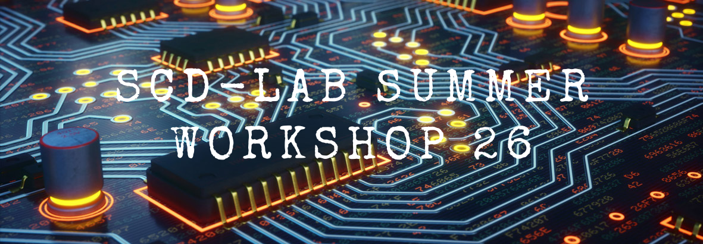

# SCD-Lab-Summer-Workshop-26

Teaching materials and lab setup for the 2026 SCD Lab summer workshop.

## 🤗 Welcome

Thank you for spending part of your precious summer at National Sun Yat-sen
University (NSYSU), Taiwan, to participate in this Science Innovation Camp.

This lab-immersion course combines three lectures with three hands-on labs.
The lectures give you just enough background to get started. In the labs, you
will write a few lines of code, make LEDs move and dim on a real board, and
finally build a small matrix-multiplication circuit, the kind of calculation
used by modern AI.

## 💡 What You Will Learn

- Explain why matrix multiplication is a core computation for modern AI.
- Describe the path from a digital IC idea to working hardware.
- Represent information using bits, binary numbers, and digital logic.
- Write and simulate simple SystemVerilog hardware modules.
- Build and verify a combinational 3x3 matrix-multiplication circuit.
- Explain clocks, registers, and how sequential circuits store state.
- Design simple sequential circuits for the ZedBoard LEDs and switches.
- Build and verify a three-cycle sequential 3x3 matrix-multiplication circuit.
- Compare software runtime with hardware latency and explain why specialized
  hardware can accelerate AI workloads.

## 🚀 Workshop Outline

| Activity | Title |
| --- | --- |
| [Lecture 1][1] | Introduction to Digital IC Design |
| [Lecture 2][2] | Verilog Basics and Combinational Circuits |
| [Lab 1][3]     | 3x3 Combinational Matrix-Multiplication Circuit |
| [Lecture 3][4] | Introduction to Sequential Circuits |
| [Lab 2][5]     | Simple Sequential Circuits |
| [Lab 3][6]     | 3x3 Sequential Matrix-Multiplication Circuit |

[1]: lectures/01_intro_to_dd/README.md
[2]: lectures/02_verilog_basics_and_comb_ckts/README.md
[3]: labs/01_3x3_comb_matmul_ckt/README.md
[4]: lectures/03_intro_to_seq_ckts/README.md
[5]: labs/02_simple_seq_ckt/README.md
[6]: labs/03_3x3_seq_matmul_ckt/README.md

