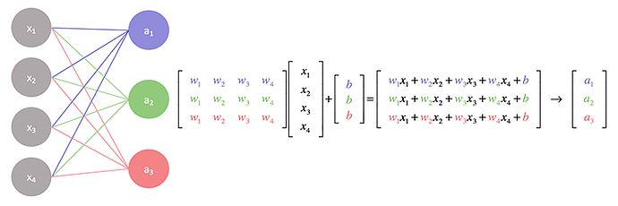
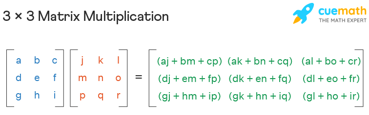
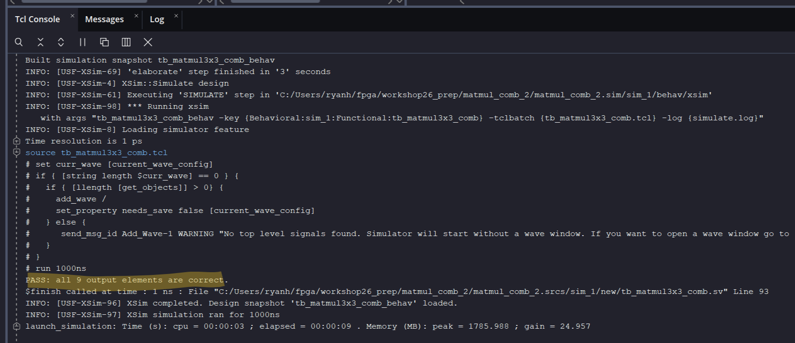

# Lab 1: 3x3 Combinational Matmul Circuit（3x3 組合邏輯矩陣乘法電路）

## Outline（大綱）

1. Why Matrix Multiplication?（為何選矩陣乘法？）
2. 3x3 Matrix Multiplication Refresher（3x3 矩陣乘法複習）
3. Introduction to Vivado（Vivado 簡介）
4. `for` Loops and Nested `for` Loops（`for` 迴圈與巢狀 `for` 迴圈）
5. Data Layout: Flattened Matrix Vectors（資料配置：扁平化矩陣向量）
6. Understand the 3x3 Matrix Multiplication Testbench（理解 3x3 矩陣乘法測試平台）
7. Build a Combinational 3x3 Matrix-Multiplication Circuit（建立組合邏輯 3x3 矩陣乘法電路）
8. Lab Discussion Questions（實驗討論問題）

## 1. Why Matrix Multiplication?（為何選矩陣乘法？）

**Matrix multiplication（矩陣乘法）** is one of the central **computational
workloads（計算工作負載）** in modern science and AI. It combines many numbers
using the same repeated multiply-and-add pattern（乘法加法模式）, making it both
mathematically important and well suited to acceleration with specialized
hardware（專用硬體）.

| Field | How matrix multiplication（矩陣乘法） is used |
| --- | --- |
| Science and engineering | Simulate physical systems, analyze measurements, and solve systems of equations. |
| Computer graphics | Transform and combine positions, images, and other visual data. |
| Artificial intelligence | Compute the layers of neural networks during training and inference. |

Modern AI models（模型） perform enormous numbers of matrix multiplications
（矩陣乘法）. This is why GPUs（圖形處理器）, AI accelerators（AI 加速器）, and
specialized ASICs（特殊應用積體電路） devote so much hardware to
multiply-and-add operations（乘加法運算） and moving matrix data efficiently.

<p align="left"></p>
▲ AI and Matrix Multiplication（AI 與矩陣乘法）
<br>
    
[🎬 How to Represent a Neural Network with Matrices (如何用矩陣表示神經網路)][2]

> [!NOTE]
> A 3x3 matrix multiplier（3x3 矩陣乘法器） is small enough to understand
> completely, yet it contains the same core ideas as much larger workloads:
> data layout（資料配置）, repeated arithmetic（重複算術運算）, parallel hardware
> （平行硬體）, verification（驗證）, and the tradeoff between combinational
> （組合邏輯） and sequential designs（循序設計）. It is therefore a useful
> capstone workload（工作負載） for this workshop.

## 2. 3x3 Matrix Multiplication Refresher（3x3 矩陣乘法複習）

Matrix multiplication（矩陣乘法） combines two matrices（矩陣）, `A` and `B`, to
create a new matrix（矩陣）, `C`:

```text
C = A × B
```

For this lab, all three matrices（矩陣） are 3x3. Each output element（輸出元素）
`C[i][j]` is created by taking row（列） `i` from `A`, column（行） `j` from `B`,
multiplying matching elements（元素）, and adding the products. This operation
is called a **dot product（內積）**.

```text
C[i][j] = A[i][0] × B[0][j] + A[i][1] × B[1][j] + A[i][2] × B[2][j]
```

> [!TIP]
> The first index（索引） selects a row（列）, and the second index selects a
> column（行）. Each output（輸出） multiplies a row from `A` and a column from `B`.

<p align="left"></p>
▲ 3x3 Matrix Multiplication（3x3 矩陣乘法）

### Work Out Matrix C by Hand（手算矩陣 C）

Consider these two input matrices:

```text
            [ 1  2  3 ]           [ 9  8  7 ]
        A = [ 4  5  6 ]       B = [ 6  5  4 ]
            [ 7  8  9 ]           [ 3  2  1 ]
```

To calculate `C[0][0]`, use row 0 of `A` and column 0 of `B`:

```text
C[0][0] = A[0][0] × B[0][0] + A[0][1] × B[1][0] +  A[0][2] × B[2][0]
        = 1 × 9 + 2 × 6 + 3 × 3 = 9 + 12 + 9 = 30
```

> [!NOTE]
> Please work out matrix C by hand for each student.

## 3. Introduction to Vivado（Vivado 簡介）

**Vivado** is an **electronic design automation (EDA，電子設計自動化)** tool
developed by AMD for FPGA designs（FPGA 設計）. It can simulate（模擬） a
SystemVerilog design（SystemVerilog 設計）, check its behavior, and later turn
it into hardware that runs on an FPGA（現場可程式化邏輯閘陣列）.

For this lab, we will use Vivado only for **simulation（模擬）**. You will write
the combinational matrix-multiplication circuit（組合邏輯矩陣乘法電路） and run
the testbench（測試平台） to check its result. You do **not** need the actual
ZedBoard FPGA board（ZedBoard FPGA 開發板） for Lab 1.

<p align="center"></p>

## 4. `for` Loops and Nested `for` Loops（`for` 迴圈與巢狀 `for` 迴圈）

A `for` loop（`for` 迴圈） repeats the same hardware-description pattern（硬體
描述模式） a fixed number of times. It does not make the circuit（電路） wait
through several clock cycles（時脈週期）. The EDA tool expands a fixed loop into
the required repeated logic.

### `for` Loop（ `for` 迴圈）

This module（模組） inverts each bit（位元） of a 4-bit input（4 位元輸入）. The
loop describes four NOT（非） operations, one for each bit position（位元位置）.

```systemverilog
module invert_four_bits (
    input  logic [3:0] a,
    output logic [3:0] y
);
    integer i;

    always_comb begin
        for (i = 0; i < 4; i = i + 1) begin
            y[i] = ~a[i];
        end
    end
endmodule
```

### Nested `for` Loops（巢狀 `for` 迴圈）

Nested loops（巢狀迴圈） are useful when a circuit（電路） has two dimensions,
such as rows（列） and columns（行）. This example creates a 3x3 grid（方格） of
AND（且） operations. Each output bit（輸出位元） is the AND of one row input
（列輸入） and one column input（行輸入）.

```systemverilog
module and_grid_3x3 (
    input  logic [2:0] row_bits,
    input  logic [2:0] column_bits,
    output logic [8:0] grid
);
    integer i, j;

    always_comb begin
        for (i = 0; i < 3; i = i + 1) begin
            for (j = 0; j < 3; j = j + 1) begin
                grid[i * 3 + j] = row_bits[i] & column_bits[j];
            end
        end
    end
endmodule
```

For `i = 1` and `j = 2`, the code assigns `grid[5]` from
`row_bits[1] & column_bits[2]`. The 3x3 matrix-multiplication circuit（3x3
矩陣乘法電路） uses the same nested-loop structure（巢狀迴圈結構）: one loop for
an output row（輸出列）, one for an output column（輸出行）, and a third loop for
the dot-product（內積） terms.

## 5. Data Layout: Flattened Matrix Vectors（資料配置：扁平化矩陣向量）

The matrix-multiplication module（矩陣乘法模組） receives each 3x3 input matrix
（輸入矩陣） as one **flat vector（扁平化向量）** rather than nine separate ports
（連接埠）. Every input entry（輸入元素） is a 4-bit unsigned value（4 位元無號
值）, so nine entries require `9 × 4 = 36` bits（位元）.

```systemverilog
input  logic [35:0]  a;
input  logic [35:0]  b;
output logic [107:0] c;
```

The data layout（資料配置） of `a` and `b` uses **row-major order（列優先順序）**:
row（列） 0 from left to right, then row 1, then row 2. The first entry（元素）
occupies the lowest four bits（最低四個位元）.

| Matrix entry（矩陣元素） | Entry index（元素索引） | Bit positions（位元位置） in `a` or `b` |
| --- | --- | --- |
| `[0][0]` | 0 | `[3:0]` |
| `[0][1]` | 1 | `[7:4]` |
| `[0][2]` | 2 | `[11:8]` |
| `[1][0]` | 3 | `[15:12]` |
| `[1][1]` | 4 | `[19:16]` |
| `[1][2]` | 5 | `[23:20]` |
| `[2][0]` | 6 | `[27:24]` |
| `[2][1]` | 7 | `[31:28]` |
| `[2][2]` | 8 | `[35:32]` |

For example, `a[3:0]` holds `A[0][0]`, and `b[27:24]` holds `B[2][0]`.

### Result Vector（結果向量）

The module（模組） uses 12 bits（位元） for each entry（元素） of the output matrix
（輸出矩陣） `C`, so all nine results require `9 × 12 = 108` bits. The output
vector（輸出向量） uses the same row-major order（列優先順序）:

| Result entry（結果元素） | Bit positions（位元位置） in `c` |
| --- | --- |
| `C[0][0]` | `[11:0]` |
| `C[0][1]` | `[23:12]` |
| `C[0][2]` | `[35:24]` |
| `C[1][0]` | `[47:36]` |
| `C[1][1]` | `[59:48]` |
| `C[1][2]` | `[71:60]` |
| `C[2][0]` | `[83:72]` |
| `C[2][1]` | `[95:84]` |
| `C[2][2]` | `[107:96]` |

### Indexed Part Selects（索引部分選取）

The matrix-multiplication circuit（矩陣乘法電路） uses an **indexed part select
（索引部分選取）** to choose one entry（元素） while the loop indices（迴圈索引）
change. The expression（運算式） below starts at a calculated bit position
（位元位置） and selects the next four bits:

```systemverilog
a[4 * (i * 3 + k) +: 4]
```

For example, when `i` is `1` and `k` is `2`, the start position（起始位置） is
`4 × (1 × 3 + 2) = 20`, so the expression（運算式） selects `a[23:20]`, which
is `A[1][2]`. The output（輸出） uses the same idea with a 12-bit part select
（12 位元部分選取）:

```systemverilog
c[12 * (i * 3 + j) +: 12]
```

## 6. Understand the 3x3 Matrix Multiplication Testbench（理解 3x3 矩陣乘法測試平台）

### What Is a Testbench?（什麼是測試平台？）

A **testbench（測試平台）** is SystemVerilog code used to test a hardware module
（硬體模組） in a simulator（模擬器）. It is not part of the circuit（電路） that
will be synthesized（綜合） onto an FPGA（現場可程式化邏輯閘陣列） or manufactured
as an IC（積體電路）. Instead, it acts like an automated experiment（自動化實驗）:
provide inputs（輸入）, observe outputs（輸出）, and compare them with expected
results（預期結果）.

<p align="left"></p>
▲ testbench components（測試平台組成）

| Testbench part（測試平台部分） | Purpose |
| --- | --- |
| Device under test (DUT，受測設計) | The circuit module（電路模組） being tested. |
| Test signals（測試訊號） | Variables that provide input values（輸入值） to the DUT. |
| Expected result（預期結果） | The value the testbench predicts the DUT should produce. |
| Check（檢查） | Code that reports `PASS` or `FAIL`. |

| Block（區塊） | Role |
| --- | --- |
| `initial` | Runs once in the simulator（模擬器）; it is used for testbench actions（測試平台動作）. |
| `always_comb` | Describes combinational hardware（組合邏輯硬體）. |
| `always_ff` | Describes clocked sequential hardware（有時脈的循序硬體）. |

**Example（範例）:** A 4-bit adder（4 位元加法器） testbench（測試平台） that
connects input signals（輸入訊號） to the adder module（加法器模組）, applies 5
and 3, and checks that the sum is 8.

```systemverilog
module tb_adder;
    // stimuli
    logic [3:0] a;
    logic [3:0] b;
    logic [4:0] sum;

    // design under test (dut)
    adder_assign dut (
        // connect interface signals
        .a(a),
        .b(b),
        .sum(sum)
    );

    initial begin
        // apply test stimuli
        a = 4'd5;
        b = 4'd3;

        // wait for result
        #1;

        // check result
        if (sum == 5'd8)
            $display("PASS: 5 + 3 = 8");
        else
            $display("FAIL: expected 8, got %0d", sum);

        $finish;
    end
endmodule
```

> [!TIP]
> - `#1` delay（延遲） gives the combinational circuit（組合邏輯電路） time to
>   respond before the result（結果） is checked.
> - `$display` prints text in the simulator log（模擬器紀錄）, and `$finish` ends
>   the simulation（模擬）.

In this lab, the testbench（測試平台） will apply two 3x3 matrices（矩陣） to the
matrix-multiplication circuit（矩陣乘法電路） and automatically check all nine
entries（元素） of the result matrix（結果矩陣）.

### Read the Complete Testbench（閱讀完整測試平台）
The complete testbench（測試平台） is available [here][1]. Read it from top to
bottom as a small simulation program（模擬程式）.

> [!WARNING]
> A testbench（測試平台）, as opposed to a design（設計）, is non-synthesizable
> （不可綜合）: it is simulation-only software（僅供模擬的軟體）.

### Signals, DUT, and Stimuli（訊號、受測設計與測試輸入）

The testbench（測試平台） declares signals（訊號）, places the design under test
(DUT，受測設計) inside the testbench, and then applies input values（輸入值） to
the DUT.

```systemverilog
logic [35:0]  a;
logic [35:0]  b;
logic [107:0] c;
logic [107:0] expected;

matmul3x3_comb dut (
    .a(a),
    .b(b),
    .c(c)
);

initial begin
    a[3:0] = 1;
    a[7:4] = 2;
    // Continue assigning the remaining entries of A and B.
end
```

- `a` and `b` are **stimuli（測試輸入）**: the testbench assigns values to them.
- `c` is produced by the DUT（受測設計）, so the testbench does not assign values
  to it.
- `expected` stores the known-correct result（已知正確結果） for comparison（比較）.
- The named connections（具名連接） `.a(a)` connect the DUT port（受測設計連接埠）
  on the left to the testbench signal（測試平台訊號） on the right.
- `initial` means the testbench block（測試平台區塊） runs once when simulation
  （模擬） starts.

### Expected Values and Output Checks（預期值與輸出檢查）

The testbench（測試平台） loads expected output values（預期輸出值）, waits briefly
for the combinational circuit（組合邏輯電路） to respond, then checks every entry
（元素） of `C`.

```systemverilog
expected[11:0] = 30;
// Continue assigning the remaining expected entries.

#1;
errors = 0;

for (i = 0; i < 3; i = i + 1) begin
    for (j = 0; j < 3; j = j + 1) begin
        if (c[12 * (i * 3 + j) +: 12]
            !== expected[12 * (i * 3 + j) +: 12]) begin
            errors = errors + 1;
        end
    end
end
```

- `#1` is a simulation delay（模擬延遲） that lets the combinational output
  （組合邏輯輸出） settle before the comparison（比較）.
- `errors` starts at zero and counts incorrect output entries（錯誤輸出元素）.
- `!==` checks whether two values differ（不同）.
- The indexed part select（索引部分選取） uses the Section 5 data layout（資料配置）
  to compare one 12-bit result entry（結果元素） at a time.
- `$finish` ends the simulation（模擬） after the results have been reported.

> [!NOTE]
> **Question:** The nested `for` loops（巢狀 `for` 迴圈） above run in the
> testbench（測試平台）. Do they create hardware（硬體） on the FPGA？How are these
> simulation loops（模擬迴圈） different from the nested loops in the synthesizable
> matrix-multiplication design（可綜合矩陣乘法設計）?

### PASS, FAIL, Waveforms, and Simulation End（通過、失敗、波形與模擬結束）

At the end of the testbench（測試平台）, `$display` prints either a PASS message
or a FAIL message. `$dumpfile` and `$dumpvars` create a waveform file（波形檔）
that can help students debug（除錯） a failure.

## 7. Build a Combinational 3x3 Matrix-Multiplication Circuit（建立組合邏輯 3x3 矩陣乘法電路）

**Specs（規格）:** Complete a combinational SystemVerilog module（組合邏輯
SystemVerilog 模組） that calculates `C = A × B` for two 3x3 input matrices
（輸入矩陣） `A` and `B`.

| Signal（訊號） | Direction（方向） | Width（寬度） | Meaning |
| --- | --- | --- | --- |
| `a` | Input（輸入） | 36 bits | Flattened（扁平化） 3x3 input matrix（輸入矩陣） `A`; each entry（元素） is 4 bits. |
| `b` | Input（輸入） | 36 bits | Flattened（扁平化） 3x3 input matrix（輸入矩陣） `B`; each entry（元素） is 4 bits. |
| `c` | Output（輸出） | 108 bits | Flattened（扁平化） 3x3 result matrix（結果矩陣） `C`; each entry（元素） is 12 bits. |

Please start with this module skeleton（模組骨架）:

```systemverilog
module matmul3x3_comb (
    input  logic [35:0]  a,
    input  logic [35:0]  b,
    output logic [107:0] c
);

    integer i, j, k;

    always_comb begin
        for (i = 0; i < 3; i = i + 1) begin
            for (j = 0; j < 3; j = j + 1) begin
                // Start this output element at zero.

                for (k = 0; k < 3; k = k + 1) begin
                    // C[i][j] = sum of A[i][k] * B[k][j].
                end
            end
        end
    end

endmodule
```

**Hints（提示）:**

1. Use three nested `for` loops（巢狀 `for` 迴圈）. Let `i` select a row（列） of
   `A`, `j` select a column（行） of `B`, and `k` select the matching elements
   （元素） used in the dot product（內積）.

2. Before adding products for one output entry（輸出元素）, set that entry of
   `C` to zero. This initialization（初始化） belongs inside the `i`/`j` loops
   but before the `k` loop.

3. Your loop structure should match this algorithm:

   ```text
   for every output row i
       for every output column j
           C[i][j] = 0
           for k = 0, 1, 2
               C[i][j] = C[i][j] + A[i][k] × B[k][j]
   ```

4. Use the matrix data layout（矩陣資料配置） described in Section 5. `A[i][k]`
   and `B[k][j]` are 4-bit values（4 位元值）, while `C[i][j]` is a 12-bit value
   （12 位元值）.

5. Output bit width（輸出位元寬度）: the largest 4-bit input value（4 位元輸入值）
   is 15, so one product（乘積） can be as large as `15 × 15 = 225`; the sum of
   three products can be as large as 675. A 12-bit output entry（12 位元輸出
   元素） is wide enough.

6. Test one output（輸出） mentally before running the whole design（設計）. For
   the matrices（矩陣） in Section 2, `C[0][0]` must be 30.

### Expected Output (通過條件)
<p align="left"></p>
▲ 🎉 your design passes when you see this line（當你看到這行時代表你設計的電路通過此輪測試）


## 8. Lab Discussion Questions（實驗討論問題）

1. Why do you think this lab stores each matrix（矩陣） in one flattened vector
   （扁平化向量） instead of using nine separate 4-bit input ports（輸入連接埠）?
   What is one benefit and one challenge of this choice?
2. When the nested-loop indices are `i = 2`, `j = 1`, and `k = 0`, which
   entries（元素） of `A` and `B` are multiplied, and which entry（元素） of `C`
   is updated?
3. The testbench（測試平台） uses one pair of input matrices（輸入矩陣）. Why does
   one PASS result not prove that every possible matrix multiplication（矩陣乘法）
   works? Propose a second pair of input matrices that would test the design
   （設計） in a different way.

[1]: ../../rtl/comb_matmul/comb_tb.sv
[2]: https://youtu.be/lFOOjeH2wsY?si=jM21QkqCADBltiyC
