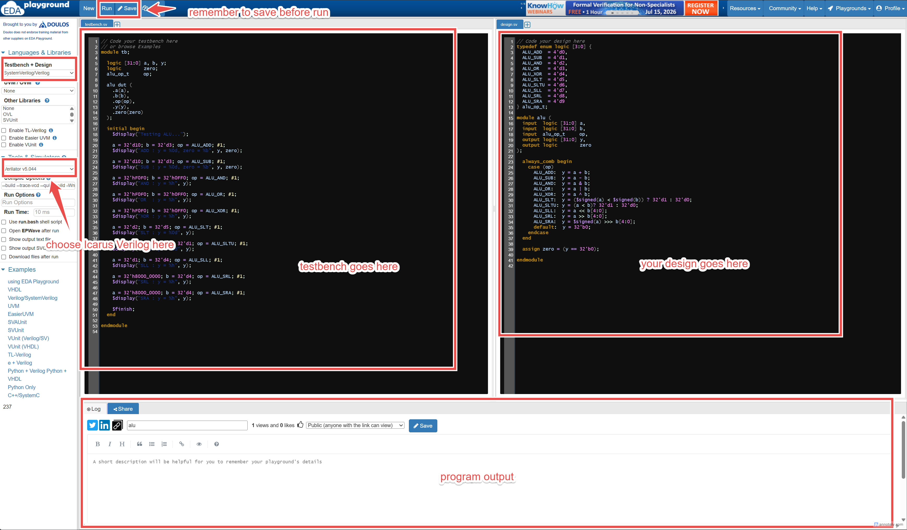

# Lab 1: 3x3 Combinational Matmul Ckt and Testbench

## Outline

1. Refresh 3x3 matrix multiplication and calculate one output dot product by hand.
2. Welcome to EDA Playground.
3. Introduction to testbenches
4. Map matrix entries to the flattened Verilog input vectors.
5. Complete the nested-loop combinational matrix multiplication circuit
6. Read the testbench inputs, expected outputs, and pass/fail checks.

## 1. 3x3 Matrix Multiplication Refresher

Matrix multiplication combines two matrices, `A` and `B`, to create a new
matrix, `C`:

```text
C = A × B
```

For this lab, all three matrices are 3x3. Each output element `C[i][j]` is
created by taking row `i` from `A`, column `j` from `B`, multiplying matching
elements, and adding the products. This operation is called a **dot product**.

```text
C[i][j] = A[i][0] × B[0][j] + A[i][1] × B[1][j] + A[i][2] × B[2][j]
```

> [!TIP]
> The first index selects a row, and the second index selects a column.
> Each output multiplies a row from `A` and a column from `B`.

<p align="center"></p>
▲ 3x3 Matrix Multiplication

### Work Out Matrix C by Hand

Consider these two input matrices:

```text
            [ 1  2  3 ]           [ 9  8  7 ]
        A = [ 4  5  6 ]       B = [ 6  5  4 ]
            [ 7  8  9 ]           [ 3  2  1 ]
```

To calculate `C[0][0]`, use row 0 of `A` and column 0 of `B`:

```text
C[0][0] = A[0][0] × B[0][0] + A[0][1] × B[1][0] +  A[0][2] × B[2][0]
        = 1 × 9 + 2 × 6 + 3 × 3 = 9 + 12 + 9 = 30
```

> [!NOTE]
> Please work out matrix C by hand for each student.

## 2. Welcome to EDA Playground

EDA Playground is a browser-based environment for writing, compiling, and
simulating HDL code. If you have not already done so, sign up for a free
EDA Playground account before continuing.

https://www.edaplayground.com/loginpage

## 3. Introduction to Testbenches

A **testbench** is SystemVerilog code used to test a hardware module in a
simulator. It is not part of the circuit that will be synthesized onto an FPGA
or manufactured as an IC. Instead, it acts like an automated experiment:
provide inputs, observe outputs, and compare them with expected results.

<p align="center"></p>
▲ testbench components

| Testbench part | Purpose |
| --- | --- |
| Device under test (DUT) | The circuit module being tested. |
| Test signals | Variables that provide input values to the DUT. |
| Expected result | The value the testbench predicts the DUT should produce. |
| Check | Code that reports `PASS` or `FAIL`. |

**Example:** A 4-bit adder testbench that creates input signals,
connects them to the adder module, applies `5` and `3`, and checks that the sum
is `8`.

```systemverilog
module tb_adder;
    // stimuli
    logic [3:0] a;
    logic [3:0] b;
    logic [4:0] sum;

    // design under test (dut)
    adder_assign dut (
        // connect interface signals
        .a(a),
        .b(b),
        .sum(sum)
    );

    initial begin
        // apply test stimuli
        a = 4'd5;
        b = 4'd3;

        // wait for result
        #1;

        // check result
        if (sum == 5'd8)
            $display("PASS: 5 + 3 = 8");
        else
            $display("FAIL: expected 8, got %0d", sum);

        $finish;
    end
endmodule
```

> [!TIP]
> - `initial` means the testbench block runs once when simulation starts.
> - `#1` delay gives the combinational circuit time to respond before the result is checked.
> - `$display` prints text in the simulator log, and `$finish` ends the simulation.

In this lab, the testbench will apply two 3x3 matrices to the matmul circuit
and automatically check all nine entries of the result matrix.

<p align="center"></p>
▲ EDA Playground Guideline
