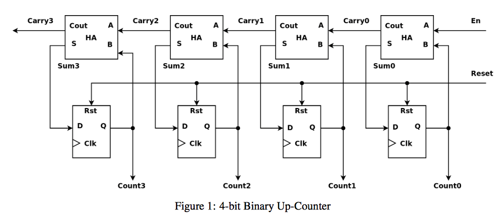

# Lab 2. Simple Sequential Circuits

## Outline

1. 4-Bit Counter Circuit
2. ZedBoard Peripherals
3. LED Comet Circuit
4. PWM LED Dimmer Circuit

## 1. 4-Bit Up Counter Circuit

Build a 4-bit up counter that increments once per rising clock edge.
First, run the counter testbench and observe its value on every clock cycle.
After reaching 15, the 4-bit counter wraps back to 0. Then run the circuit on
the ZedBoard, where provided software prints the counter value in the console.

> [!NOTE]
> `$display` prints text only during simulation. It does not create a console
> on the ZedBoard. The provided software prints the counter value in the
> console.

### Specs

| Signal | Direction | Width | Description |
| --- | --- | --- | --- |
| `clk` | Input | 1 bit | ZedBoard clock signal. |
| `rst` | Input | 1 bit | Synchronous reset. |
| `count` | Output | 4 bits | Current counter value. |

### Module Skeleton

```systemverilog
module counter (
    input  logic        clk,
    input  logic        rst,
    output logic [3:0]  count
);

    // Implement the counter here.

endmodule
```

**Testbench:** [counter_tb.sv](../../rtl/simple_seq_ckts/counter/counter_tb.sv)

<p align="left"></p>
▲ 4-bit up counter
<br>

> [!NOTE]
> **Question:** Can a 4-bit counter count up without bounds? If not, what
> happens when it reaches its largest value?

## 2. ZedBoard Peripherals

The ZedBoard provides physical inputs and outputs that let users observe a
digital circuit outside the simulator.

| Peripheral | Direction | Use in this lab |
| --- | --- | --- |
| User LEDs | Output | Display the LED Comet pattern and PWM brightness. |
| DIP switches | Input | Select the PWM brightness value. |
| Pushbuttons | Input | Reset a design to its starting state. |

<p align="left"></p>
▲ ZedBoard peripherals
<br>
An XDC constraint file connects SystemVerilog port names to physical ZedBoard
pins, which makes the design work on the FPGA.

We will primarily use the user LEDs in this lab. Switches and the center
pushbutton support the PWM dimmer and reset behavior.

## 3. LED Comet Circuit

Build a circuit that moves one illuminated LED across the eight ZedBoard user
LEDs, then wraps it back to the first LED. Use a clock-divider counter so the
movement is slow enough to see.

### Specs

| Signal | Direction | Width | Description |
| --- | --- | --- | --- |
| `clk` | Input | 1 bit | 100 MHz ZedBoard clock signal. |
| `rst` | Input | 1 bit | Synchronous reset. |
| `led` | Output | 8 bits | ZedBoard user LEDs. Exactly one bit should be `1`. |

### Hints

- The clock-divider counter decides when the LED pattern should move.
- Curly braces concatenate bit groups: `{left_bits, right_bits}` creates one
  wider vector by placing `left_bits` before `right_bits`.
- Use concatenation to shift the LED pattern and wrap one bit from an end of
  the vector back to the other end.

> [!NOTE]
> **LED-pattern challenge:** Modify the LED Comet circuit to create one of these patterns:
>
> - a light that bounces from one end to the other;
> - alternating LEDs, such as `10101010` and `01010101`;
> - LEDs that fill one at a time and then clear;
> - an original pattern of your own design.

**Constraints:** [led_comet.xdc](../../rtl/simple_seq_ckts/led_comet/led_comet.xdc)

## 4. PWM LED Dimmer Circuit

**Pulse-width modulation (PWM)**
- controls the average power sent to a device by switching its signal rapidly between `0` and `1`.
- For an LED, keeping the signal at `1` for more of each repeating interval makes it appear brighter, and vice versa.
- PWM is one technology used to control the brightness of a screen. For example, iPhones use PWM to control the brightness of their screens.

<p align="left"></p>
▲ iPhone controls screen brightness using PWM
<br>

Build a PWM circuit that controls the apparent brightness of LED 0. The circuit
reads the eight ZedBoard switches as an 8-bit brightness value.

### Specs

| Signal | Direction | Width | Description |
| --- | --- | --- | ---|
| `clk` | Input | 1 bit | 100 MHz ZedBoard clock signal. |
| `rst` | Input | 1 bit | Synchronous reset. |
| `brightness` | Input | 8 bits | Brightness value from the eight user switches. |
| `led` | Output | 1 bit | PWM output connected to LED 0. |

### Hints

- Use an running up counter
- Use a comparator to decide whether `led` is currently on: the LED should be
  on while the counter value is smaller than the brightness value.
- The counter is sequential logic; the comparison is combinational logic.

**Constraints:** [pwm_dimmer.xdc](../../rtl/simple_seq_ckts/pwm_dimmer/pwm_dimmer.xdc)

> [!NOTE]
> **Question:** Which part of the PWM dimmer is sequential, and which part is combinational?
