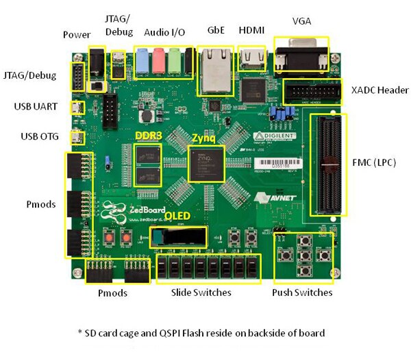
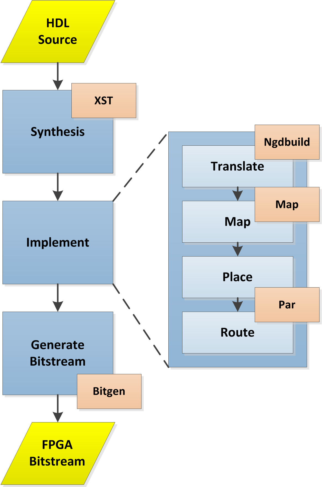
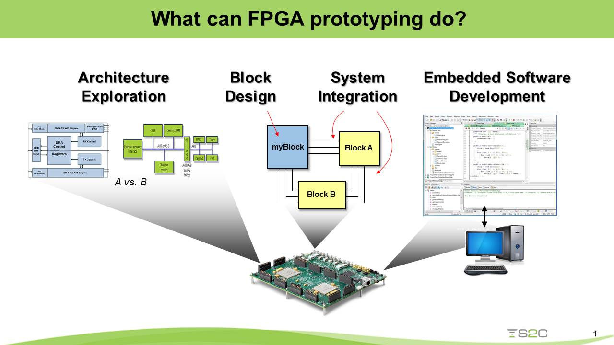
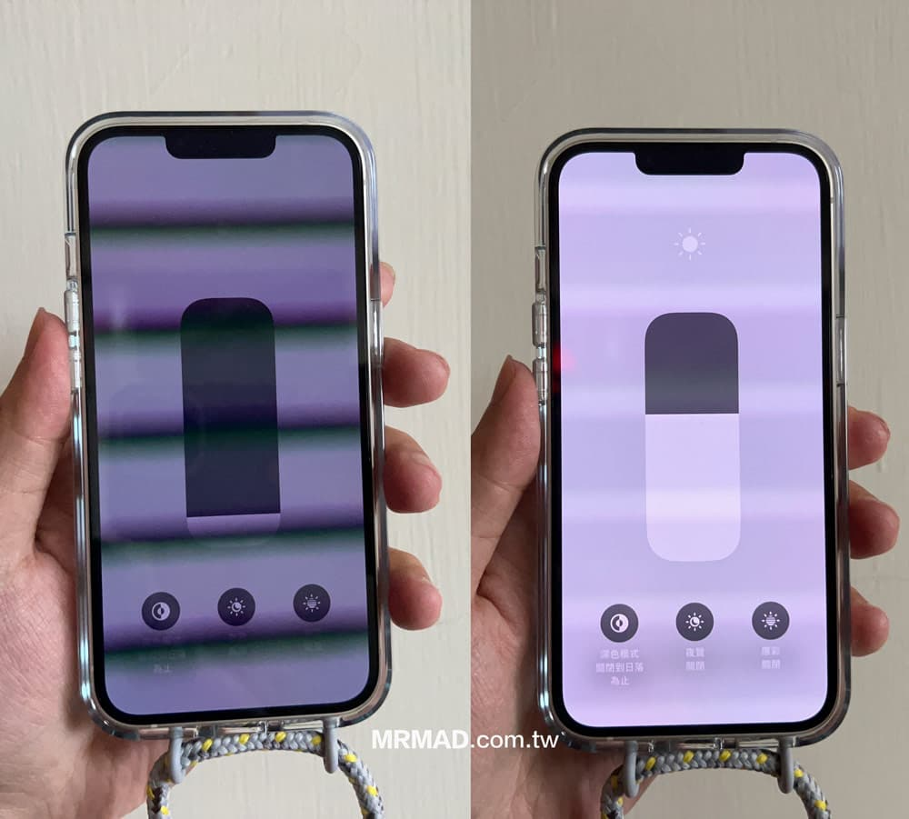

# Lab 3. Simple Sequential Circuits（簡單循序電路）

## Outline（大綱）

1. 4-Bit Counter Circuit（4 位元計數器電路）
2. ZedBoard Peripherals（ZedBoard 周邊設備）
3. LED Comet Circuit（LED 彗星電路）
4. PWM LED Dimmer Circuit（PWM LED 調光電路）

## 1. 4-Bit Up Counter Circuit（4 位元遞增計數器電路）

Build a 4-bit up counter（4 位元遞增計數器） that increments once per rising
clock edge（上升時脈邊緣）. First, run the counter testbench（計數器測試平台） and
observe its value on every clock cycle（時脈週期）. After reaching 15, the 4-bit
counter wraps（回繞） back to 0. Then run the circuit（電路） on the ZedBoard, where
provided software（提供的軟體） prints the counter value in the console （主控台）.

> [!NOTE]
> `$display` prints text only during simulation（模擬）. It does not create a
> console（主控台） on the ZedBoard. The provided software（提供的軟體） prints the
> counter value in the console.

### Specs（規格）

| Signal（訊號） | Direction（方向） | Width（寬度） | Description |
| --- | --- | --- | --- |
| `clk` | Input（輸入） | 1 bit | ZedBoard clock signal（時脈訊號）. |
| `rst` | Input（輸入） | 1 bit | Synchronous reset（同步重設）. |
| `count` | Output（輸出） | 4 bits | Current counter value（目前計數器值）. |

### Module Skeleton（模組骨架）

```systemverilog
module counter (
    input  logic        clk,
    input  logic        rst,
    output logic [3:0]  count
);

    // Implement the counter here.

endmodule
```

**Testbench（測試平台）:** [counter_tb.sv](../../rtl/simple_seq_ckts/counter/counter_tb.sv)

<p align="left"></p>
▲ 4-bit up counter（4 位元遞增計數器）
<br>
<br>

> [!NOTE]
> **Question:** Can a 4-bit counter（4 位元計數器） count up without bounds? If
> not, what happens when it reaches its largest value?

## 2. ZedBoard Peripherals（ZedBoard 周邊設備）

The ZedBoard provides physical inputs（實體輸入） and outputs（實體輸出） that let
users observe a digital circuit（數位電路） outside the simulator（模擬器）.

| Peripheral（周邊設備） | Direction（方向） | Use in this lab |
| --- | --- | --- |
| User LEDs（使用者 LED） | Output（輸出） | Display the LED Comet pattern（LED 彗星圖樣） and PWM brightness（PWM 亮度）. |
| DIP switches（撥碼開關） | Input（輸入） | Select the PWM brightness value（PWM 亮度值）. |
| Pushbuttons（按鈕） | Input（輸入） | Reset a design（設計） to its starting state（起始狀態）. |

<p align="left"></p>
▲ ZedBoard peripherals（ZedBoard 周邊設備）

<br>
<br>
    
An **XDC constraint file（XDC 約束檔）** connects SystemVerilog port names
（連接埠名稱） to physical ZedBoard pins（實體 ZedBoard 腳位）, which
makes the design work on the FPGA（現場可程式化邏輯閘陣列）.

We will primarily use the user LEDs in this lab. Switches（開關） and
the center pushbutton（中央按鈕） support the PWM dimmer（PWM 調光器） and reset
（重設） behavior.

### ZedBoard FPGA and Vivado（ZedBoard FPGA 與 Vivado）

[🎬 What is an FPGA (Field Programmable Gate Array)? | FPGA Concepts（FPGA 介紹）][1]

The ZedBoard includes a **field-programmable gate array (FPGA，現場可程式化
邏輯閘陣列)**. In this workshop, the FPGA runs the circuits（電路） described in
SystemVerilog. **Vivado** is the **electronic design automation (EDA，電子設計
自動化)** tool developed by AMD that we use for the FPGA workflow（FPGA 流程）.

### From SystemVerilog to FPGA Deployment（從 SystemVerilog 到 FPGA 部署）

The path from a SystemVerilog design to running hardware has several steps:

<p align="left"></p>
▲ Xilinx FPGA Design Flow（Xilinx FPGA 設計流程）
<br>

- **Synthesis（綜合）** converts the RTL（暫存器傳輸層級） description into a
  netlist（電路網表） built from FPGA resources such as lookup tables（查找表）,
  flip-flops（正反器）, memories（記憶體）, and arithmetic blocks（算術區塊）.
- **Implementation（實作）** maps that netlist（電路網表） to the specific FPGA,
  places logic（邏輯） in physical locations, routes connections（連線） between
  it, and checks timing（時序）.
- **Bitstream generation（產生位元串流）** creates configuration data（設定資料）
  that downloads to the FPGA's programmable logic（可程式化邏輯） to become the
  designed circuit.

### FPGA as an IC Front-End Prototyping Platform（FPGA 作為 IC 前端原型驗證平台）

In the **IC front-end design flow（IC 前端設計流程）**, simulation（模擬） is the
first way to check whether an RTL design behaves correctly.
An FPGA prototype（FPGA 原型） provides a second, more physical validation step
（實體驗證步驟） without manufacturing（製造） a custom chip（晶片）. Computer
architects（計算機架構工程師） can use it to test architectural ideas, while RTL
designers can use it to validate that their hardware descriptions（硬體描述） work
together in a real system.

An FPGA prototype（FPGA 原型） does not exactly match a future ASIC's
speed, area（面積）, or power use（功耗）. It is still valuable because
it can reveal functional（功能）, interface（介面）, and system-level（系統層級）
problems early—before committing a design to manufacturing（製造）.

In Labs 2 and 3, Vivado will turn your sequential circuits（循序電路） into
hardware that runs on the ZedBoard FPGA.

<p align="left"></p>
▲ FPGA Prototyping（FPGA 原型驗證）

## 3. LED Comet Circuit（LED 彗星電路）

Build a circuit that moves one illuminated（發亮的） LED across the
eight ZedBoard user LEDs, then wraps（回繞） it back to the
first LED. Use a clock-divider counter（除頻計數器） so the movement is slow
enough to see.

### Specs（規格）

| Signal | Direction | Width | Description |
| --- | --- | --- | --- |
| `clk` | Input | 1 bit | 100 MHz ZedBoard clock signal（時脈訊號）. |
| `rst` | Input | 1 bit | Synchronous reset（同步重設）. |
| `led` | Output | 8 bits | ZedBoard user LEDs. Exactly one bit（位元）should be `1`. |

### Hints（提示）

- The clock-divider counter（除頻計數器） decides when the LED pattern（LED 圖樣）
  should move.
- Curly braces concatenate（串接） bit groups（位元群組）: `{left_bits,
  right_bits}` creates one wider vector（更寬的向量） by placing `left_bits`
  before `right_bits`.
- Use concatenation（串接） to shift the LED pattern（LED 圖樣） and wrap one bit
  （位元） from an end of the vector（向量） back to the other end.

> [!NOTE]
> **LED-pattern challenge（LED 圖樣挑戰）:** Modify the LED Comet circuit（LED
> 彗星電路） to create one of these patterns（圖樣）:
>
> - a light that bounces from one end to the other;
> - alternating LEDs, such as `10101010` and `01010101`;
> - LEDs that fill one at a time and then clear;
> - an original pattern of your own design.

**Constraints（約束檔）:** [led_comet.xdc](../../rtl/simple_seq_ckts/led_comet/led_comet.xdc)

## 4. PWM LED Dimmer Circuit（PWM LED 調光電路）

[🎬 PWM (Pulse Width Modulation) as Fast As Possible (PWM 介紹)][2]
<br>
<br>
[🎬 STM32 Guide #3: PWM + Timers (PWM 運作原理)][3]

**Pulse-width modulation (PWM，脈衝寬度調變)**

- controls the average power（平均功率） sent to a device（裝置） by switching its
  signal（訊號） rapidly between `0` and `1`.
- For an LED, keeping the signal at `1` for more of each repeating interval
  （重複區間） makes it appear brighter, and vice versa.
- PWM is one technology used to control the screen brightness（螢幕亮度）. For
  example, iPhones use PWM to control the brightness of their screens.

<p align="left"></p>
▲ iPhone controls screen brightness using PWM（iPhone 使用 PWM 控制螢幕亮度）
<br>

Build a PWM circuit（PWM 電路） that controls the apparent brightness（表觀亮度）
of LED 0. The circuit reads the eight ZedBoard switches（ZedBoard 開關） as an
8-bit brightness value（8 位元亮度值）.

### Specs（規格）

| Signal（訊號） | Direction（方向） | Width（寬度） | Description |
| --- | --- | --- | ---|
| `clk` | Input（輸入） | 1 bit | 100 MHz ZedBoard clock signal（時脈訊號）. |
| `rst` | Input（輸入） | 1 bit | Synchronous reset（同步重設）. |
| `brightness` | Input（輸入） | 8 bits | Brightness value（亮度值） from the eight user switches（開關）. |
| `led` | Output（輸出） | 1 bit | PWM output（PWM 輸出） connected to LED 0. |

### Hints（提示）

- Use a running up counter（遞增計數器）.
- Use a comparator（比較器） to decide whether `led` is currently on: the LED
  should be on while the counter value（計數器值） is smaller than the brightness
  value（亮度值）.
- The counter（計數器） is sequential logic（循序邏輯）; the comparison（比較） is combinational logic（組合邏輯）.

**.xdc constraint file（.xdc 約束檔）:** [pwm_dimmer.xdc](../../rtl/simple_seq_ckts/pwm_dimmer/pwm_dimmer.xdc)

> [!NOTE]
> **Question:** Which part of the PWM dimmer（PWM 調光器） is sequential（循序）,
> and which part is combinational（組合邏輯）?

[1]: https://youtu.be/WY-F3knih7c?si=RB0-Ry9jvXej3jyj
[2]: https://youtu.be/ISzRh5eN_Pg?si=5yei901tcLP9Da8B
[3]: https://youtu.be/AjN58ceQaF4?si=TaWgT2_vQfslyOhd
