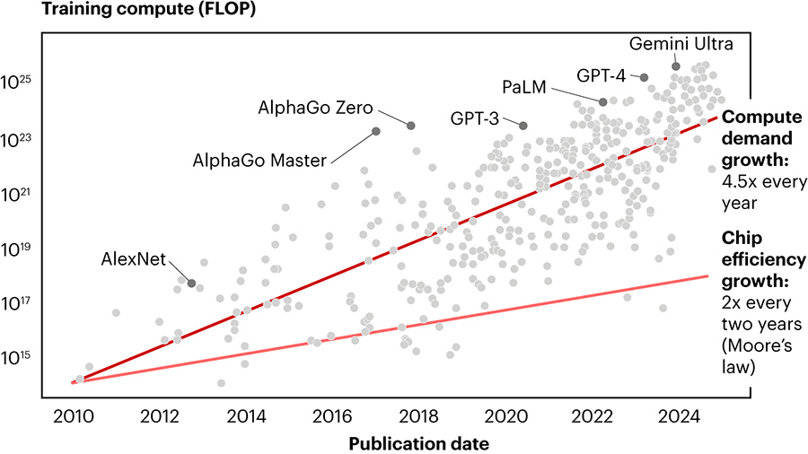
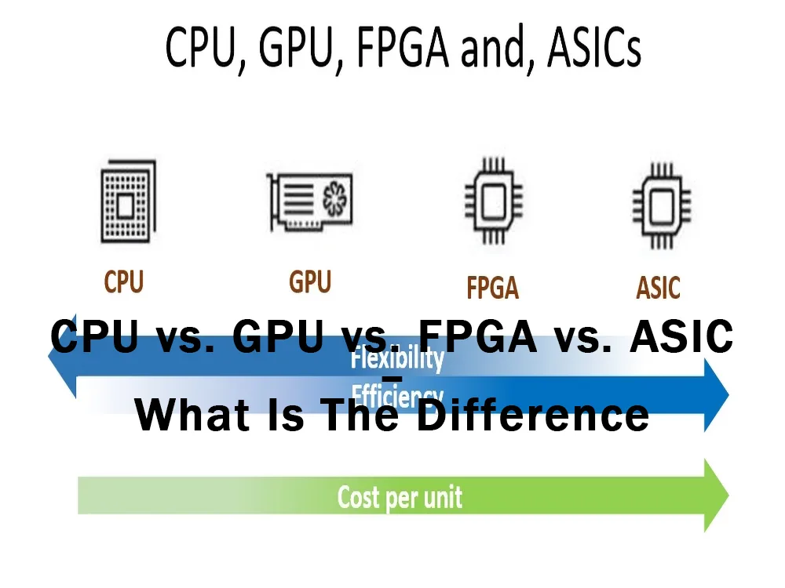
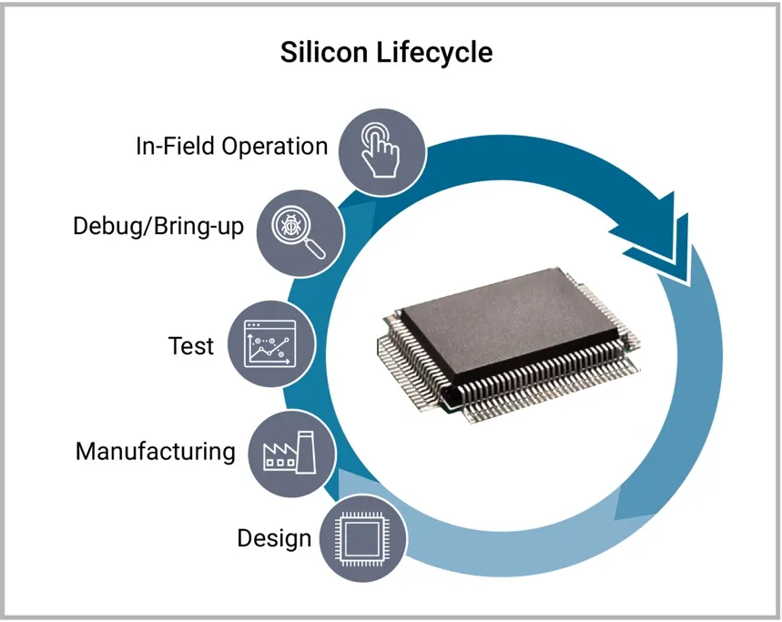
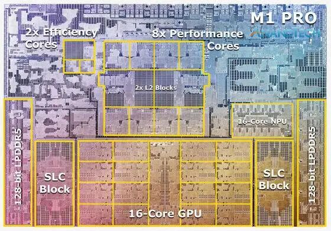
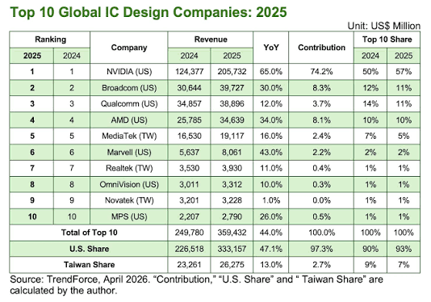
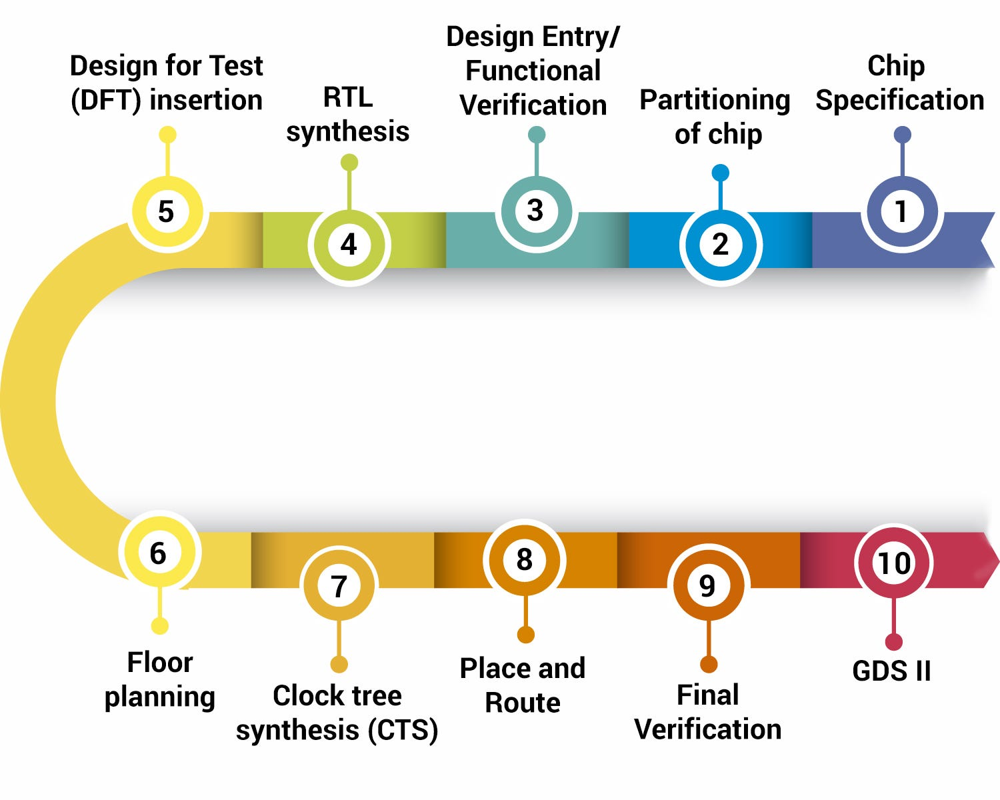
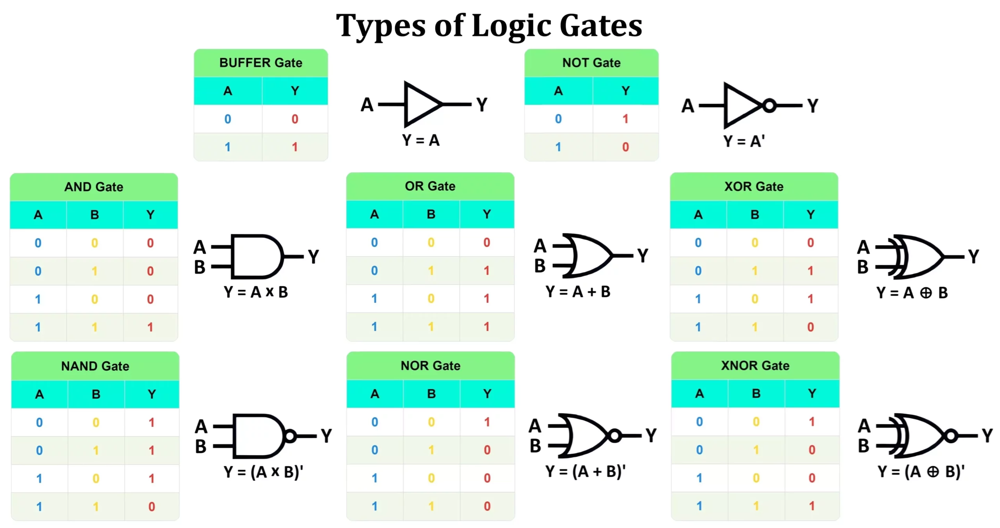

# Lecture 1. Introduction to Digital IC Design（數位積體電路設計）

## Outline（大綱）

1. AI Compute Power（AI 算力）: From Models to Chips（從模型到晶片）
2. From Chip Idea to Real Hardware（從晶片構想到實體硬體）
3. Bits and Binary Values（位元與二進位值）
4. Inputs, Outputs, and Truth Tables（輸入、輸出與真值表）
5. Logic Gates and Small Digital Circuits（邏輯閘與小型數位電路）

## 1. AI Compute Power（AI 算力）: From Models to Chips（從模型到晶片）

### Why AI Needs Compute（為何 AI 需要算力）

AI is used for many tasks, not only **large language models (LLMs，大型語言
模型)**.

| AI application category | Examples |
| --- | --- |
| Large language models | ChatGPT and Claude answer questions, summarize information, and help write code |
| Generative media | Create images, video, music, or other media from prompts |
| Recommendation systems | Predict what a person may want to watch, hear, read, or buy |
| Computer vision | Recognize objects, find patterns, or detect problems in medical images and manufactured products |
| Robotics and driver assistance | Tesla self-driving systems and robots use AI to understand surroundings and choose actions |

Behind these applications are AI **models（模型）** that process a great deal of
data. **Training（訓練）** a model means repeatedly adjusting it using many
examples; **inference（推論）** means using the trained model to answer a new
question or make a prediction. Both tasks require a huge number of
**arithmetic operations（算術運算）**, especially **matrix multiplication
（矩陣乘法）**. That is why AI depends on powerful computer chips.

<p align="left"></p>
▲ AI model compute power demand grows faster than chip efficiency（AI 模型運算需求的成長速度快於晶片算力的成長）

### GPUs and AI ASICs（GPU 與 AI ASIC）

Two important kinds of AI compute hardware are **graphics processing units
(GPUs，圖形處理器)** and **application-specific integrated circuits (ASICs，
特殊應用積體電路)**.

| Hardware | Main idea | Examples |
| --- | --- | --- |
| GPU（圖形處理器） | A programmable processor with many parallel compute units（可同時運算的單元） | NVIDIA and AMD GPUs |
| ASIC（特殊應用積體電路） | A chip designed for a specific class of tasks, often to improve speed or energy efficiency | Google TPU; Amazon Trainium and Inferentia |

<p align="left"></p>
▲ CPU vs GPU vs FPGA vs ASIC（CPU、GPU、FPGA 與 ASIC 的比較）
<br>

A **central processing unit (CPU，中央處理器)** is the general-purpose
processor in a computer. A **field-programmable gate array (FPGA，現場可程式化
邏輯閘陣列)** is a chip whose digital circuit（數位電路） can be configured after it is
manufactured.

> [!NOTE]
> **Question:** Name three products you use in daily life that contain chips.

> [!NOTE]
> **Question:** A company wants one chip to run many different AI tasks. Would
> it likely choose a GPU or an ASIC? Why?

> [!NOTE]
> **Question:** Why might a self-driving car need to make decisions much faster
> than a chatbot?

> [!NOTE]
> **Question:** Name two situations where a company might choose an ASIC over
> an FPGA, and two situations where it might choose an FPGA over an ASIC.

## 2. From Chip Idea to Real Hardware（從晶片構想到實體硬體）

### A Chip Lifecycle（晶片生命週期）

Making a chip is a long process. Different teams transform an idea into a
physical device that can be placed in a computer, phone, or **data center
（資料中心）**.

```text
Application and Workload（應用與工作負載）
        ↓
Chip Specification and Architecture（晶片規格與架構）
        ↓
Front-End IC Design（前端 IC 設計）: RTL（暫存器傳輸層級） and Functional Verification（功能驗證）
        ↓
Back-End IC Design（後端 IC 設計）: Synthesis（綜合）, Physical Design（實體設計）, and Signoff（簽核）
        ↓
Manufacturing（製造）
        ↓
Packaging and Testing（封裝與測試）
        ↓
System Integration（系統整合）
        ↓
Application（應用）
```

<p align="left"></p>
▲ Silicon Lifecycle（矽晶片生命週期）
<br>
<br>

<p align="left"></p>
▲ Apple M1 SoC Die Shot（Apple M1 系統單晶片裸晶照）
<br>
<br>

| Stage | What happens | Example companies |
| --- | --- | --- |
| Application and workload（應用與工作負載） | Identify a problem to solve, such as AI inference, networking, or image processing. | OpenAI, Anthropic |
| IC design（積體電路設計）: specification, front-end, and back-end | Define the architecture, describe and verify the behavior in RTL（暫存器傳輸層級）, then create and check the physical chip layout. | NVIDIA, Google, Broadcom, MediaTek (聯發科) |
| Manufacturing（製造） | Fabricate the physical chip in a semiconductor foundry（半導體晶圓廠）. | TSMC (台積電) |
| Packaging and testing（封裝與測試） | Package the manufactured chip, connect it to the outside world, and test that it works correctly. | ASE Technology (日月光), SPIL (矽品) |
| System integration（系統整合） | Connect chips to memory（記憶體）, power（供電）, cooling（散熱）, software, and the rest of a computer system. | Foxconn (鴻海), Quanta Computer (廣達) |

<p align="left"></p>
▲ Top 10 IC design companies globally (全球營收前10 IC設計公司 龍頭)

> [!NOTE]
> **Question:** Why might one company design a chip while another company
> manufactures it?

### Where IC Design Fits（IC 設計的位置）

The slowing of **Moore's Law（摩爾定律）** and the end of **Dennard scaling
（丹納德定律）** make careful IC
design more important than ever: better performance now requires smarter chip
architectures and more efficient hardware, not only smaller transistors.

**IC design（積體電路設計）** starts after a chip idea becomes a
**specification（規格）** and ends when a finished **physical layout（實體佈局）**
is ready for manufacturing. It has three connected steps.

<p align="left"></p>
▲ IC design flow（IC 設計流程）


#### Chip Specification and Architecture（晶片規格與架構）

Engineers decide what the chip must do, how fast it should be, how much energy
it may use, and which major **blocks（功能區塊）** it needs. They also decide how
data moves between those blocks.

#### Front-End IC Design（前端 IC 設計）

Front-end designers describe the chip's behavior in RTL（暫存器傳輸層級） using languages such
as Verilog. **Register-transfer level (RTL，暫存器傳輸層級)** describes how
data moves and is processed on clock cycles. They **verify（驗證）** that the
design computes the correct result before a physical chip exists. This workshop
focuses on this step.

#### Back-End IC Design（後端 IC 設計）

Back-end designers transform verified RTL（暫存器傳輸層級） into a physical chip layout. They
place circuit blocks, **route（繞線）** wires, and check that the chip meets its
timing（時序）, power（功耗）, and area（面積） goals.

## 3. Bits and Binary Values（位元與二進位值）

### From the Real World to Digital Data（從現實世界到數位資料）

Before a computer can process information, that information must be represented
as **digital data（數位資料）**: bits with values of `0` and `1`. **Sensors
（感測器）** and input devices（輸入裝置） turn real-world signals into numbers, while
agreed-upon **encodings（編碼方式）** let computers store and exchange those
numbers consistently.

| Information | How it is digitized（如何數位化） | Binary representation（二進位表示） |
| --- | --- | --- |
| Text（文字） | Each character is assigned a code by an encoding such as Unicode. | Character codes stored as groups of bits, often bytes（位元組）. |
| Sound（聲音） | A microphone measures air-pressure changes many times per second. | Each measurement is stored as a binary number called a sample（取樣值）. |
| Image（影像） | A camera divides a scene into pixels（像素） and measures the color of each pixel. | Each pixel’s red, green, and blue values are stored as binary numbers. |
| Video（影片） | A video is a sequence of images together with sound samples. | Binary pixel values for frames（影格） plus binary audio samples. |
| Numbers and sensor readings（數字與感測器讀值） | A program or sensor produces a numerical value. | Integers（整數） or decimal values encoded in binary formats. |

<p align="left"></p>
▲ From Multimedia to Digitized Signals（從多媒體到數位化訊號）

### A Bit（位元）

A **bit（位元）** is a binary digit. It has one of two values: `0` or `1`. In a
real **digital circuit（數位電路）**, those values are represented by ranges of
electrical voltage（電壓）.

### Number Representation（數字表示法）

Multiple bits can represent a number using **binary representation（二進位
表示）**. Each bit position has a value that is a power of two. For example,
the three-bit binary number `101` means:

$$
1 \times 2^2 + 0 \times 2^1 + 1 \times 2^0 = 5
$$

| Decimal | 3-bit binary |
| --- | --- |
| 0 | `000` |
| 1 | `001` |
| 2 | `010` |
| 3 | `011` |
| 4 | `100` |
| 5 | `101` |
| 6 | `110` |
| 7 | `111` |

**Unsigned binary（無號二進位）** is useful when a value cannot be negative,
such as the number of pixels in an image. Computers also need a way to
represent negative values, such as a temperature below zero or a subtraction
result.

#### Two's Complement（二補數數值表示法）

The most common binary representation for **signed integers（有號整數）** is
**two's complement（二補數數值表示法）**. With four bits, it represents values from
`-8` through `+7`. Positive values use their usual binary form. To find a
negative value, invert every bit of the positive value and add `1`.

For a positive example, `+5` is represented directly as `0101`.

For a negative example, to represent `-5` with four bits:

```text
+5 = 0101
invert the bits: 1010
add 1:           1011  = -5
```

The same pattern of bits can mean different values depending on the number
representation being used.

| 4-bit pattern | Unsigned binary value（無號二進位值） | Two's-complement value（二補數值） |
| --- | --- | --- |
| `0000` | 0 | 0 |
| `0101` | 5 | +5 |
| `0111` | 7 | +7 |
| `1000` | 8 | -8 |
| `1011` | 11 | -5 |
| `1111` | 15 | -1 |

> [!NOTE]
> **Question:** Name one thing around you that could be turned into binary data.
> What could `0` and `1` mean for it?

> [!NOTE]
> **Question:** Work with a partner: write decimal 6 as a 3-bit binary number.

> [!NOTE]
> **Question:** Can a 3-bit unsigned number represent decimal 8? Explain your
> reasoning.

> [!NOTE]
> **Question:** What decimal number does the four-bit two's-complement pattern
> `1011` represent?

## 4. Inputs, Outputs, and Truth Tables（輸入、輸出與真值表）

### A Circuit's Rule（電路規則）

A digital circuit has **inputs（輸入）**, **outputs（輸出）**, and a rule that
connects them. A **truth table（真值表）** lists the output for every possible
input combination（輸入組合）.

### Example: Two Switches and an LED（兩個開關與一個 LED）

Consider a circuit（電路） that turns on an LED only when both switches are on.
Its output（輸出） is the logical AND（且） of two input bits（輸入位元）.

| Switch A（開關 A） | Switch B（開關 B） | LED output（LED 輸出） |
| --- | --- | --- |
| 0 | 0 | 0 |
| 0 | 1 | 0 |
| 1 | 0 | 0 |
| 1 | 1 | 1 |

### From a Table to a Circuit（從真值表到電路）

Truth tables（真值表） are a useful bridge between an idea stated in words and
the logic circuit（邏輯電路） that implements it. Students should be able to
read this table, predict an output（輸出）, and complete a similar table for
another rule.

## 5. Logic Gates and Small Digital Circuits（邏輯閘與小型數位電路）

<p align="left"></p>
▲ logic gates（邏輯閘）
<br>
<br>

### Common Logic Gates（常見邏輯閘）

**Logic gates（邏輯閘）** are the smallest common building blocks of digital
circuits（數位電路）.

| Gate（邏輯閘） | Output rule（輸出規則） |
| --- | --- |
| AND（且） | `1` only when both inputs are `1` |
| OR（或） | `1` when either input is `1` |
| NOT（非） | reverses one input: `0` becomes `1`, and `1` becomes `0` |
| XOR（互斥或） | `1` when two inputs are different |

| Input A（輸入 A） | Input B（輸入 B） | AND output（且閘輸出） |
| --- | --- | --- |
| `0` | `0` | `0` |
| `0` | `1` | `0` |
| `1` | `0` | `0` |
| `1` | `1` | `1` |

| Input A（輸入 A） | Input B（輸入 B） | OR output（或閘輸出） |
| --- | --- | --- |
| `0` | `0` | `0` |
| `0` | `1` | `1` |
| `1` | `0` | `1` |
| `1` | `1` | `1` |

| NOT input（非閘輸入） | NOT output（非閘輸出） |
| --- | --- |
| `0` | `1` |
| `1` | `0` |

### Combining Gates（組合邏輯閘）

Larger digital circuits（數位電路） are made by connecting logic gates（邏輯閘）.
The output（輸出） of one gate（邏輯閘） can become the input（輸入） of another
gate. For example, the **Boolean expression（布林運算式）**

```text
Y = (A AND B) OR (NOT C)
```

can be built in three steps:

```text
Logic Gate 1（邏輯閘 1）: X1 = A AND B
Logic Gate 2（邏輯閘 2）: X2 = NOT C
Logic Gate 3（邏輯閘 3）: Y  = X1 OR X2
```

Logic Gate 1（邏輯閘 1） and Logic Gate 2（邏輯閘 2） can operate in
parallel（平行） because they use different inputs（輸入）. Logic Gate 3（邏輯閘 3）
uses their outputs（輸出） to produce the final value. This same idea, combining
small blocks（功能區塊） into larger blocks, is how designers build
adders（加法器）, arithmetic units（算術單元）, and eventually a
matrix-multiplication circuit（矩陣乘法電路）.

> [!NOTE]
> **Question:** For `Y = (A AND B) OR (NOT C)`, which two gate operations can
> happen at the same level?

> [!NOTE]
> **Question:** Draw a gate-level circuit（邏輯閘電路） for
> `Y = (A OR B) AND C`.

> [!NOTE]
> The important idea is that many gates can operate at the same time. This parallel behavior is one reason hardware can accelerate computation.
