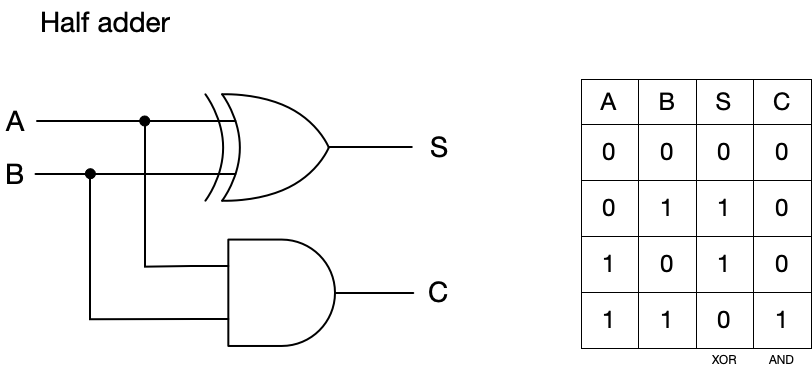
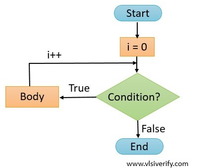
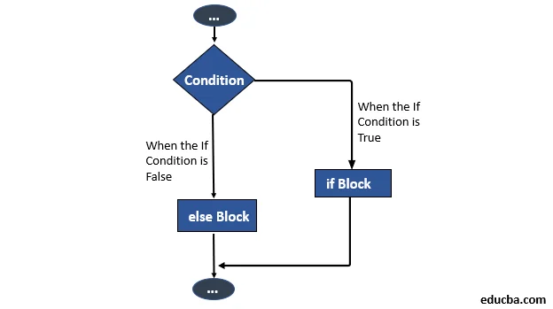
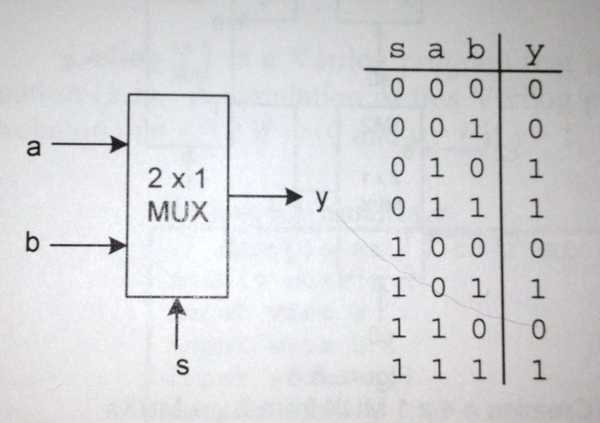
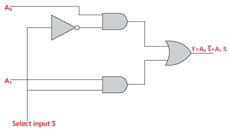

# Lecture 2. Verilog Basics and Combinational Circuits（Verilog 基礎與組合邏輯電路）

## Outline（大綱）

1. Electronic Design Automation（電子設計自動化，EDA）
2. HDL and SystemVerilog（硬體描述語言與 SystemVerilog）
3. Read a Module（閱讀模組）: module name, port list, and `logic` signals.
4. Bit Widths and Unsigned Integer Values（位元寬度與無號整數值）
5. Combinational Logic with `always_comb` and `for` Loops（使用 `always_comb` 與 `for` 迴圈的組合邏輯）
6. Homework: Understand a Nested `for` Loop（理解巢狀 `for` 迴圈）
7. Optional Challenge: Build a 4-Bit Mini ALU（4 位元小型算術邏輯單元）

## 1. Electronic Design Automation（電子設計自動化，EDA）

**Electronic Design Automation (EDA，電子設計自動化)** is the use of software
tools to design, **simulate（模擬）**, **verify（驗證）**, and build electronic
circuits（電子電路）. These tools let engineers test a hardware idea long before
they manufacture（製造） an **integrated circuit (IC，積體電路)** or program a
**field-programmable gate array (FPGA，現場可程式化邏輯閘陣列)**.

EDA exists because a modern circuit has far too many gates（邏輯閘）, wires
（連線）, and physical details for one person to draw and check by hand. It lets
engineers describe what a circuit（電路） should do, while the EDA software helps turn
that description into a design that can be tested and built. Engineers still
need to understand the important ideas, but they do not need to manually manage
every connection in a large chip（晶片）.

[🎬 How VLSI Revolutionized Semiconductor Design (VLSI是如何重塑晶片設計的)][1]

| Activity | Purpose | Workshop example |
| --- | --- | --- |
| Write HDL（撰寫硬體描述語言） | Describe a digital circuit（數位電路）. | Write a SystemVerilog module（模組）. |
| Simulation（模擬） | Predict how the circuit behaves before hardware exists. | Run the matrix-multiplication design and testbench（測試平台） in Vivado |
| Waveform viewer（波形檢視器） | View signals（訊號） as they change over time. | Debug an unexpected simulation result（模擬結果）. |
| Synthesis（綜合） | Convert a hardware description into a circuit netlist（電路網表） for an FPGA or IC technology. | Use FPGA tools before programming the ZedBoard. |

<p align="left"></p>
▲ The EDA Market Duopoly（EDA 市場雙寡頭）

## 2. HDL and SystemVerilog（硬體描述語言與 SystemVerilog）

### 2.1 HDL（硬體描述語言）

Verilog and SystemVerilog are **Hardware Description Languages (HDLs，硬體描述語言)**, which describes what a digital circuit（數位電路） does
and how its parts connect. It does not give a processor（處理器） a list of software instructions（軟體指令） to execute one at a time.

| Idea | HDL（硬體描述語言） | Programming languages（程式語言） |
| --- | --- | --- |
| Language examples（語言例子） | Verilog, SystemVerilog | C, Python |
| Main purpose（主要目的） | Describe how an electronic circuit（電子電路） is connected and behaves. | Tell an existing computer which steps to perform. |
| Result（結果） | A design that can be simulated（模擬）, implemented on an FPGA（現場可程式化邏輯閘陣列）, or manufactured as an IC（積體電路）. | A program that runs on a computer, phone, or other device. |
| Operations（運作方式） | Many hardware blocks（硬體區塊） can operate at the same time in parallel（平行）. | Usually execute statements in order. |
| When it operates（何時運作） | The circuit（電路） operates continuously when powered. | A program performs its steps when it is run. |

<p align="left"></p>
▲ hardware vs software（硬體 vs 軟體）

### 2.2 RTL（暫存器傳輸層級）

**Register-Transfer Level (RTL，暫存器傳輸層級)** is a common way to use an HDL
（硬體描述語言）. It describes the logic（邏輯） that transforms values and the
registers（暫存器） that store or transfer those values on clock cycles（時脈週期）.
RTL（暫存器傳輸層級） is used to design the digital parts of ICs（積體電路） and
FPGAs（現場可程式化邏輯閘陣列）.

### 2.3 Verilog（硬體描述語言）

Verilog was created in the 1980s as a language for describing and simulating
digital hardware（數位硬體）. It became widely used in IC（積體電路） and FPGA
（現場可程式化邏輯閘陣列） design. As
chips（晶片） became larger and their testing became more complicated, engineers needed
a language with additional design and verification（驗證） capabilities.

Phil Moorby created Verilog at Gateway Design Automation in the mid-1980s for
digital-circuit simulation（數位電路模擬）. Before HDLs（硬體描述語言） became
common, designers often worked much more directly with gate schematics（邏輯閘
電路圖） and low-level circuit details. Verilog let a designer describe a
chip（晶片） at a higher level, while other specialists and EDA tools could handle
tasks such as verification（驗證）, physical layout（實體佈局）, and manufacturing
preparation（製造準備）. This division of work made it possible for teams to design
much larger and more complex chips（晶片）.

[🎬 An Introuction to Verilog (Verilog 介紹)][2]

<p align="left"></p>
▲ Phil Moorby, who created Verilog in the 1980s（1980 年代創造 Verilog 的 Phil Moorby）

### 2.4 SystemVerilog（Verilog 的延伸語言）

SystemVerilog was developed in the early 2000s as **an extension of Verilog
（Verilog 的延伸語言）**. It keeps the core ideas of Verilog while adding features
that help engineers describe larger designs and test them more thoroughly.

SystemVerilog includes the core ideas of Verilog, so much simple Verilog code
also works in SystemVerilog. It is widely used for both circuit design（電路
設計） and verification（驗證）.

> [!NOTE]
> In this workshop, we will be using SystemVerilog to describe digital circuits（數位電路）

## 3. Reading a Module（閱讀模組）

A **module（模組）** is a named hardware building block（硬體區塊）. It can
represent a small logic gate（邏輯閘）, an adder（加法器）, a
matrix-multiplication circuit（矩陣乘法電路）, or an entire chip（晶片）. A module
（模組） has a name and a list of ports（連接埠） that show how it connects to
other hardware.

```systemverilog
module and_gate (
    // ------ start port list ------ 
    input  logic a,
    input  logic b,
    output logic y
    // ------ end port list ------ 
);

    // Circuit behavior will go here.

endmodule
```

> [!TIP]
> In SystemVerilog, comments（註解） start with `//`. They explain code and are ignored EDA tools.

| Part | Meaning |
| --- | --- |
| `module and_gate` | Starts a module（模組） named `and_gate`. |
| Port list（連接埠清單） | The signals（訊號） inside the parentheses; these are the module's connections to the outside world. |
| `input` | A signal（輸入訊號） received by the module. In this example, `a` and `b` are inputs（輸入）. |
| `output` | A signal（輸出訊號） produced by the module. In this example, `y` is an output（輸出）. |
| `logic` | A SystemVerilog signal type（訊號型別） used for circuit signals（電路訊號）. |
| `endmodule` | Marks the end of the module（模組）. |

The module header describes the circuit's interface（介面）. Another module
（模組） can connect to `a`, `b`, and `y` without needing to know the
implementation（實作） inside. This idea lets designers build large systems from
smaller, reusable hardware blocks（硬體區塊）.

## 4. Bit Widths and Unsigned Integer Values（位元寬度與無號整數值）

### 4.1 Bit Widths（位元寬度）
Digital signals（數位訊號） have a fixed number of bits called their **bit width
（位元寬度, 位寬）**. A single signal（訊號） can hold one bit, while a vector（向量）
holds several bits.

```systemverilog
module bit_width_example;
    logic        enable;  // One bit: 0 or 1
    logic [3:0]  count;   // Four bits
    logic [7:0]  result;  // Eight bits
endmodule
```

In `logic [3:0] count`, the signal has four bit positions: `3`, `2`, `1`, and
`0`. The left number is the **most-significant bit (MSB，最高有效位元)** and the
right number is the **least-significant bit (LSB，最低有效位元)**.

### 4.2 Unsigned Integer Values（無號整數值）

| Bit width（位元寬度） | Smallest value | Largest value |
| --- | --- | --- |
| 1 bit | 0 | 1 |
| 2 bits | 0 | 3 |
| 3 bits | 0 | 7 |
| 4 bits | 0 | 15 |
| 8 bits | 0 | 255 |

> [!TIP]
> An **unsigned signal（無號訊號）** with `n` bits can represent values from `0` through $2^n - 1$.

### 4.3 SystemVerilog Number Literals（SystemVerilog 常數值）

SystemVerilog can write a **number literal（常數）** with an explicit
**width（位元寬度）** and **base（進位制）**. This makes it clear how many bits a
value uses and whether its digits（數字） are written in binary（二進位）, decimal
（十進位）, or another base（進位制）.

The general pattern is:

```text
<width>'<base><digits>
```

| Part | Meaning |
| --- | --- |
| `<width>` | The number of bits used to store the value. |
| `'` | Separates the width from the base（進位制） and digits（數字）. |
| `<base>` | `b` for binary（二進位）, `d` for decimal（十進位）, or `h` for hexadecimal（十六進位）. |
| `<digits>` | The value written in the chosen base（進位制）. |

For example, these two literals describe the same four-bit value:

```systemverilog
4'd9     // Four bits; decimal（十進位） 9
4'b1001  // Four bits; binary（二進位） 1001, which equals decimal（十進位） 9
```

Another example is `8'h2A`: it uses eight bits, `h` means hexadecimal, and
`2A` represents decimal 42. Hexadecimal is useful because each hexadecimal
digit represents exactly four bits.

> [!TIP]
> Match the width to the signal that will hold the value. For example,
> `logic [3:0] count` can hold `4'd9`, while `4'd16` does not fit in four bits.

## 5. Combinational Logic（組合邏輯） with `always_comb` and `for` Loops（迴圈）

### 5.1 Behavioral-Level SystemVerilog（行為層級 SystemVerilog）

There are several ways to describe hardware. At a low level, a designer can
connect individual logic gates（邏輯閘）. At the **behavioral level（行為層級）**,
a designer writes what a block（硬體區塊） should compute, and EDA tools
determine the gates and wires needed to implement that behavior.

Behavioral code（行為層級程式碼） is still a hardware description（硬體描述）, not
ordinary software. For a **synthesizable design（可綜合設計）**, the EDA tool
converts the description into a circuit（電路） that can be implemented on an
FPGA or manufactured（製造） as an IC.

### 5.2 Clock and Combinational Circuits（時脈與組合邏輯電路）

A **clock signal（時脈訊號）** is a repeating `0`/`1` signal used to synchronize
**sequential circuits（循序電路）**. Registers（暫存器） update at a clock edge
（時脈邊緣）, which lets designers measure sequential work in clock cycles
（時脈週期）.

<p align="left"></p>
▲ Combinational Circuit（組合邏輯電路）
<br>
<br>
Pure combinational logic（組合邏輯） does not take an exact number of clock
cycles（時脈週期） to compute; instead, its output（輸出） settles after a small
physical delay（延遲）.

When a circuit is used with a clock（時脈）, designers choose a clock period
（時脈週期） long enough for the combinational result（組合邏輯結果） to settle
before the next clock edge（時脈邊緣）. The result can then be captured on that
next edge, which is often described as completing within one clock cycle.

Combinational logic（組合邏輯） depends only on its current inputs（目前輸入）.
It has no clock（時脈） and no memory（記憶）. When an input（輸入） changes, the
output（輸出） recalculates after its delay（延遲）.

> [!NOTE]
> **Question:** A combinational circuit（組合邏輯電路） uses a 100 MHz clock
> （時脈） and finishes its work in one clock cycle（時脈週期）. How long does it
> take to finish its work?

### 5.3 `always_comb`（組合邏輯程序區塊）

SystemVerilog uses `always_comb` to describe combinational logic（組合邏輯）.

Example:

```systemverilog
module adder_always_comb (
    input  logic [3:0] a,
    input  logic [3:0] b,
    output logic [4:0] sum
);
    always_comb begin
        sum = a + b;
    end
endmodule
```

The same adder（加法器） can be written with a continuous （連續) `assign` statement (敘述）:

```systemverilog
module adder_assign (
    input  logic [3:0] a,
    input  logic [3:0] b,
    output logic [4:0] sum
);
    assign sum = a + b;
endmodule
```

These two descriptions are equivalent: both describe combinational hardware
（組合邏輯硬體） that continuously calculates the sum of `a` and `b`.

This block describes an adder（加法器）. The statement does not mean that an
adder runs only once; it describes an adder circuit（加法器電路） that
continuously responds to `a` and `b`.

<p align="left"></p>
▲ half adder circuit and its truth table（半加器電路與其真值表，sum = {C, S}）

### 5.4 `for` Loops Describe Repeated Hardware（`for` 迴圈用以描述重複硬體）

A `for` loop（`for` 迴圈） is useful when the same operation is repeated a fixed
number of times. In a synthesizable combinational block（可綜合的組合邏輯
區塊）, the loop does not create a processor（處理器） that repeatedly executes
instructions. Instead, the EDA tool expands the fixed loop into the required
hardware connections（硬體連線）.

<p align="left"></p>
▲ for loop flow chart（for 迴圈流程圖）
<br>
<br>
    
Example:

```systemverilog
module add_three_elements (
    input  logic [3:0] data [0:2],
    output logic [5:0] total
);
    always_comb begin
        total = 0;

        for (int i = 0; i < 3; i = i + 1) begin
            total = total + data[i];
        end
    end
endmodule
```

This code describes the addition of three values. The loop limit（迴圈上限）, `3`,
is fixed so the tool knows how much hardware to create. The same pattern will
let students describe the repeated multiplications and additions in the 3x3
combinational matrix-multiplication circuit（3x3 組合邏輯矩陣乘法電路）.

> [!NOTE]
> Question: What hardware（硬體） does this piece of HDL（硬體描述語言） describe?

> [!NOTE]
> Question: Can you describe the same hardware（硬體） without a loop（迴圈）?
> (Hint: use `assign`.)

### 5.5 `if ... else` Describes a Multiplexer（`if ... else` 描述多工器）

In a combinational block（組合邏輯區塊）, an `if ... else` statement describes a
circuit（電路） that chooses one input（輸入） based on a control signal（控制訊號）
(`select`). This circuit is called a **multiplexer（mux, 多工器）**. It is like a
digital switch（數位開關）: the selected input is connected to the output（輸出） (`y`).

<p align="left"></p>
▲ if-else flow chart（ if-else 流程圖）
<br>

```systemverilog
module mux2 (
    input  logic select,
    input  logic a,
    input  logic b,
    output logic y
);
    always_comb begin
        if (select) begin
            y = a;
        end else begin
            y = b;
        end
    end
endmodule
```

When `select` is `1`, `y` receives `a`; when `select` is `0`, `y` receives `b`.

<p align="left"></p>
▲ 2-to-1 multiplexer circuit and its truth table（2 對 1 多工器電路與其真值表）

<p align="left"></p>
▲ Implementation of mux using AND, OR gates（使用 AND, OR 閘實現的多工器）

## 6. Homework: Understand a Nested `for` Loop（理解巢狀 `for` 迴圈）

Read the following module（模組） and determine what circuit（電路） it describes.

```systemverilog
module and_grid_2x2 (
    input  logic [1:0] row_bits,
    input  logic [1:0] column_bits,
    output logic [3:0] grid
);
    integer i, j;

    always_comb begin
        for (i = 0; i < 2; i = i + 1) begin
            for (j = 0; j < 2; j = j + 1) begin
                grid[i * 2 + j] = row_bits[i] & column_bits[j];
            end
        end
    end
endmodule
```

> [!TIP]
> `&` means **bitwise AND（位元 AND）**. It produces `1` only when both input
> bits（輸入位元） are `1`.

### Questions to Consider

1. How many output bits（輸出位元） does `grid` have?
2. How many times does the assignment（指定） to `grid[...]` appear after the
   loops（迴圈） are expanded?
3. When `i = 0` and `j = 0`, which `grid` bit is assigned, and which two input
   bits（輸入位元） are used?
4. When `i = 1` and `j = 0`, which `grid` bit is assigned, and which two input
   bits（輸入位元） are used?
5. Draw the four output bits（輸出位元） as a 2x2 grid（方格）. What does each row
   and each column correspond to?

## 7. Optional Challenge: Build a 4-Bit Mini ALU（4 位元小型算術邏輯單元）

**Spec（規格）:**

| Signal name（訊號名稱） | Port direction（連接埠方向） | Bit width（位元寬度） | Description |
| --- | --- | --- | --- |
| `a` | Input（輸入） | 4 bits | First unsigned input value（第一個無號輸入值）. |
| `b` | Input（輸入） | 4 bits | Second unsigned input value（第二個無號輸入值）. |
| `op` | Input（輸入） | 2 bits | Selects the operation（運算） based on the rule in the next table. |
| `y` | Output（輸出） | 5 bits | Result of the selected operation（選擇的運算結果）. |


| `op` | Required operation（需要的運算） |
| --- | --- |
| `2'b00` | `y = a + b` |
| `2'b01` | `y = a AND b` (bitwise AND，位元 AND) |
| `2'b10` | `y = a OR b` (bitwise OR，位元 OR) |
| `2'b11` | `y = 0` |

> [!TIP]
> `2'b01` is a SystemVerilog number literal（數字常值）. The `2` means the value
> uses two bits, `b` means the value is written in binary（二進位）, and `01` is
> the binary value（二進位值）. Therefore, `2'b01` is the two-bit representation
> of decimal（十進位） 1.

> [!TIP]
> Bitwise AND（位元 AND，`&`） and bitwise OR（位元 OR，`|`） compare matching bit
> positions（位元位置） in two values. For example, `4'b0101 & 4'b0011` is `4'b0001`, while
> `4'b0101 | 4'b0011` is `4'b0111`.

Example inputs（輸入範例）:

| `a` | `b` | `op` | Expected `y` |
| --- | --- | --- | --- |
| 5 | 3 | `2'b00` | 8 |
| 5 | 3 | `2'b01` | 1 |
| 5 | 3 | `2'b10` | 7 |
| 5 | 3 | `2'b11` | 0 |

**Hint（提示）:**

```systemverilog
module mini_alu (
    input  logic [3:0] a,
    input  logic [3:0] b,
    input  logic [1:0] op,
    output logic [4:0] y
);

    // Write one always_comb block here.

endmodule
```

- Use one `always_comb` block（組合邏輯區塊） with `if` / `else if` / `else`.
- Assign `y` on every path through the conditional（條件判斷）.
- What is the bit width（位元寬度） required by `a + b`?
- Use `a & b` for bitwise AND（位元 AND） and `a | b` for bitwise OR（位元 OR）.

[1]: https://www.youtube.com/watch?v=XgbxFVyKMMo]
[2]: https://youtu.be/q1QwC3YlHG0?si=JiEyAMCr3x6MgeTB
