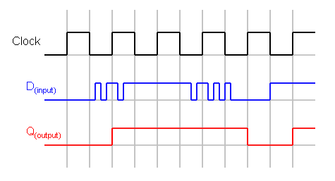

# Lecture 3. Introduction to Sequential Circuits（循序電路簡介）

## Outline（大綱）

1. Combinational and Sequential Circuits（組合邏輯與循序電路）
2. Clocks, Clock Edges, Registers, and Reset（時脈、時脈邊緣、暫存器與重設）
3. `always_ff` and Nonblocking Assignment（`always_ff` 與非阻塞指定）
4. D Flip-Flop and Its Timing Diagram（D 型正反器與其時序圖）
5. D Flip-Flop Challenge（D 型正反器挑戰）
6. Circuit Design Technique: Datapath and Controller Separation（電路設計技巧：資料路徑與控制器分離）

## 1. Combinational and Sequential Circuits（組合邏輯與循序電路）

Digital circuits（數位電路） can be divided into two broad categories（類別）. A
**combinational circuit（組合邏輯電路）** calculates an output（輸出） from its
current inputs（目前輸入）. A **sequential circuit（循序電路）** can also remember
information from earlier clock cycles（時脈週期）.

| Idea | Combinational circuit（組合邏輯電路） | Sequential circuit（循序電路） |
| --- | --- | --- |
| Output depends on（輸出取決於） | Current inputs（目前輸入） | stored values（儲存值） and current inputs |
| Memory（記憶） | No memory | Uses registers（暫存器） to store values |
| Clock（時脈） | Does not need a clock | Uses a clock to update registers |
| Computation（運算） | Produces a result after a signal delay（訊號延遲） | Can spread a calculation across several clock cycles（時脈週期） |

### Combinational Circuits（組合邏輯電路）

A combinational circuit（組合邏輯電路） has no memory（記憶）. If its inputs
（輸入） change, the circuit calculates a new output（輸出） after a small delay
（延遲）. The combinational 3x3 matrix-multiplication circuit（組合邏輯 3x3
矩陣乘法電路） from Lab 1 calculates all nine output entries（輸出元素） from the
current values of `A` and `B`.

<p align="left"></p>
▲ Combinational Circuit（組合邏輯電路）

### Sequential Circuits（循序電路）

<p align="left"></p>
▲ Sequential Circuit（循序電路）
<br>
<br>

A sequential circuit（循序電路） includes registers（暫存器）. A register stores a
value until a clock edge（時脈邊緣） tells it to update. Because it can remember a
previous value, a sequential circuit can complete part of a calculation in one cycle（週期）, save the result（結果）, and continue in the next cycle.  For example, a running-sum circuit（累加電路） can add one number per clock cycle.
（時脈週期） to a stored total（儲存的總和）.

## 2. Clocks, Clock Edges, Registers, and Reset（時脈、時脈邊緣、暫存器與重設）

### Clock Signals（時脈訊號）

A **clock（時脈）** is a signal（訊號） that repeatedly changes between `0` and
`1`. It gives sequential circuits（循序電路） a shared rhythm for updating
stored values（儲存值）. The time from one rising edge（上升邊緣） to the next
rising edge is one **clock period（時脈週期）**.

[Crystal Oscillator explained in 66 Seconds][1]

<p align="left"></p>
▲ Clock Pulse（時脈脈波）
<br>

- A **rising edge（上升邊緣）** is the change from `0` to `1`.
- A **falling edge（下降邊緣）** is the change from `1` to `0`.

> [!NOTE]
> **Question:** Can a combinational circuit's delay（組合邏輯電路的延遲） be
> longer than one clock period（時脈週期）?

> [!NOTE]
> **Question:** A sequential circuit（循序電路） needs three clock cycles（時脈
> 週期） to complete its calculation. If the clock frequency（時脈頻率） is 100
> MHz, what is the circuit's runtime（執行時間）?

### Registers（暫存器）

A **register（暫存器）** is a small storage element（儲存元件） that holds one or
more bits（位元）. It keeps its current value between clock edges（時脈邊緣）. At a
rising clock edge（上升邊緣）, a register can replace its old value with a new
value.

For example, a 12-bit register（12 位元暫存器） can hold an intermediate
matrix-multiplication sum（中間矩陣乘法總和）. A sequential matrix-multiplication
circuit（循序矩陣乘法電路） can update that sum once per clock cycle（時脈週期）
instead of calculating the entire dot product（內積） at once.

> [!NOTE]
> How registers work will be explained further in Sections 4 and 5 with D
> flip-flops（D 型正反器）.

### Reset（重設）

When an FPGA（現場可程式化邏輯閘陣列） is powered on or a simulation（模擬） begins,
stored values（儲存值） may not yet be meaningful. A **reset signal** （重設訊號） puts registers（暫存器） into a known starting state（已知起始狀態）, often
zero. This makes the circuit（電路） predictable and ensures a new calculation
starts with clean intermediate values（中間值）.

| Signal（訊號） | Purpose |
| --- | --- |
| `clk` | Provides the repeating timing signal（時序訊號）. |
| `rst` | Requests that registers（暫存器） return to their starting values（起始值）. |
| Register value（暫存器值） | Stores information from one clock cycle（時脈週期） to the next. |

## 3. `always_ff` and Nonblocking Assignment（`always_ff` 與非阻塞指定）

### `always_ff` Block（`always_ff` 區塊）

SystemVerilog uses `always_ff` to describe sequential logic（循序邏輯） built
from flip-flops（正反器） or registers（暫存器）. The letters `ff` stand for
**flip-flop（正反器）**. The block（區塊） below updates the 4-bit register（4 位元
暫存器） `q` on each rising edge（上升邊緣） of `clk`.

Example:

| Idea | `always_comb` | `always_ff` |
| --- | --- | --- |
| Describes（描述） | Combinational logic（組合邏輯） | Sequential logic（循序邏輯） using registers（暫存器） |
| Trigger（觸發時機） | When an input signal（輸入訊號） changes | At a specified clock edge（時脈邊緣） |
| Memory（記憶） | No memory | Stores values between clock edges（時脈邊緣） |
| Typical assignment（常用指定） | Blocking（阻塞）: `=` | Nonblocking（非阻塞）: `<=` |

```systemverilog
module register_4bit (
    input  logic       clk,
    input  logic       rst,
    input  logic [3:0] d,
    output logic [3:0] q
);
    always_ff @(posedge clk) begin
        if (rst) begin
            q <= 4'd0;
        end else begin
            q <= d;
        end
    end
endmodule
```

| Code | Meaning |
| --- | --- |
| `always_ff @(posedge clk)` | Run this block（區塊） at every rising edge（上升邊緣） of `clk`. |
| `if (rst)` | Check whether reset（重設） is requested. |
| `q <= 4'd0` | Reset（重設） `q` to zero. |
| `q <= d` | Store the current value of `d` in `q`. |

Because `rst` is checked only inside the rising-edge block（上升邊緣區塊）, this
example uses a **synchronous reset（同步重設）**: `q` resets at the next rising
edge, not immediately when `rst` changes.


### Nonblocking Assignment（非阻塞指定） `<=`

| Idea | Blocking assignment（阻塞指定） `=` | Nonblocking assignment（非阻塞指定） `<=` |
| --- | --- | --- |
| Left-hand side updates（左側更新） | Immediately, before the next statement runs | After the current clocked block（時脈區塊） has evaluated |
| Later statements in the same block（同區塊後續敘述） | See the new value | See the old value |
| Typical use（常見用途） | `always_comb` | `always_ff` |

Use the nonblocking assignment operator（非阻塞指定運算子）, `<=`, when
describing registers（暫存器） in an `always_ff` block（區塊）. It models the fact
that all registers triggered by the same clock edge（時脈邊緣） update together.

At a rising edge（上升邊緣）, the right-hand sides（RHS，右側） are read first. The register values（暫存器值） on the left-hand sides（LHS，左側） update only after every right-hand side has been read. This prevents one register in the block（區塊） from accidentally seeing another register's new value too early.

> [!TIP]
> For sequential logic（循序邏輯）, use `<=` inside `always_ff`. The blocking
> assignment operator（阻塞指定運算子）, `=`, is used instead in `always_comb`
> blocks（區塊） for combinational logic（組合邏輯）.

> [!NOTE]
> **Question:** What does `@(posedge clk)` mean? When does the code inside an
> `always_ff @(posedge clk)` block（區塊） run?

> [!NOTE]
> **Question:** Two registers（暫存器） are updated in the same `always_ff`
> block（區塊）. How would the behavior differ if the assignments used `=`
> instead of `<=`?

## 4. D Flip-Flop and Its Timing Diagram（D 型正反器與其時序圖）

A **D flip-flop (DFF，D 型正反器)** is a one-bit register（1 位元暫存器）. 

- It samples（取樣） the value on `d` at a rising clock edge（上升時脈邊緣）.
- It stores that sampled value on its output（輸出）, `q`.
- Between rising edges（上升邊緣）, `q` keeps its previously stored value（儲存值）
  even if `d` changes.
- In the module（模組） below, `rst` sets `q` to `0` at a rising clock edge.

```systemverilog
module dff (
    input  logic clk,
    input  logic rst,
    input  logic d,
    output logic q
);
    always_ff @(posedge clk) begin
        if (rst) begin
            q <= 0;
        end else begin
            q <= d;
        end
    end
endmodule
```

A **timing diagram（時序圖）** shows how several digital signals（數位訊號） change
over time. It helps designers check which values are present at clock edges
（時脈邊緣） and verify（驗證） that a sequential circuit（循序電路） stores and
updates data（資料） as intended.

<p align="left"></p>
▲ D Flip-Flop（D型正反器）

<p align="left"></p>
▲ D Flip-Flop Timing Diagram（D型正反器時序圖）

<br>
<br>

> [!TIP]
> Read the timing diagram as follows:
>
> - Each rising edge（上升邊緣） of `clk` is a moment when the flip-flop（正反器）
>   can update `q`.
> - At each rising edge, `q` becomes the value that `d` had at that edge.
> - A change in `d` between rising edges does not immediately change `q`.
> - If `rst` is high at a rising edge, `q` becomes `0` instead of storing `d`.

## 5. D Flip-Flop Challenge（D 型正反器挑戰）

Read the following module（模組）. It describes two D flip-flops（D 型正反器） that
share the same clock（時脈）. Please draw the block diagram（方塊圖） of this
hardware（硬體）.

```systemverilog
module two_flip_flops (
    input  logic clk,
    input  logic d,
    output logic q1,
    output logic q2
);
    always_ff @(posedge clk) begin
        q1 <= d;
        q2 <= q1;
    end
endmodule
```

> [!NOTE]
> **Question:** At the start, `d = 1`, `q1 = 0`, and `q2 = 0`.
>
> - After one rising clock edge（上升時脈邊緣）, what are `q1` and `q2`?
> - Then change `d` to `0`. After the next rising clock edge, what are `q1` and
>   `q2`?
> - Can we use blocking assignments（阻塞指定，`=`） instead of non-blocking
>   assignments（非阻塞指定，`<=`） here? Why?

## 6. Circuit Design Technique: Datapath and Controller Separation（電路設計技巧：資料路徑與控制器分離）

<p align="left"></p>
▲ Datapath and Controller Separation（資料路徑與控制器分離）
<br>

Large sequential circuits（大型循序電路） are easier to understand when divided
into a **datapath（資料路徑）** and a **controller（控制器）**.

| Part | Responsibility |
| --- | --- |
| Datapath（資料路徑） | Performs arithmetic（算術運算） and stores calculation data（計算資料）. |
| Controller（控制器） | Decides which operation（運算） happens on each clock cycle（時脈週期）. |


### Datapath（資料路徑）

The datapath（資料路徑） contains the parts that move, calculate, and store
values. It can include arithmetic units（算術單元）, multiplexers（多工器）,
registers（暫存器）, and connections（連線） that move data（資料） between those
blocks（功能區塊）.

### Controller（控制器）

The controller（控制器） does not perform the arithmetic（算術運算） itself. Instead,
it keeps track of progress and tells the datapath（資料路徑） what to do. For
example, it can wait for `start`, advance a counter（計數器） on successive
cycles（週期）, and raise `done` when the calculation（計算） is complete.

> [!TIP]
> Separating these jobs makes a design（設計） easier to build and debug（除錯）:
> - datapath（資料路徑） answers “what values are calculated?”
> - the controller（控制器） answers “when should each calculation happen?”

[1]: https://youtu.be/j5qxHloRuAE?si=ppp_T3YPTK9iHimf
