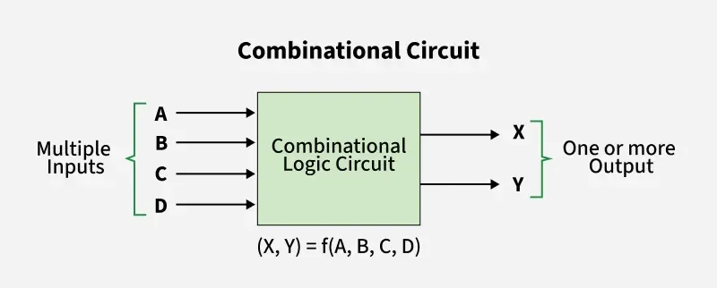
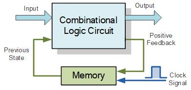
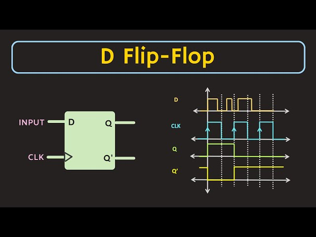
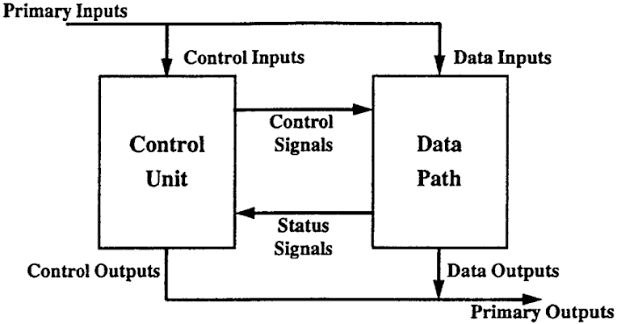

# Lecture 3. Introduction to Sequential Circuits

## Outline

1. Combinational and Sequential Circuits
2. Clocks, Clock Edges, Registers, and Reset
3. Explain `always_ff` and nonblocking assignment (`<=`).
4. D Flip Flop and Its Timing Diagram
5. D Flip-Flop Challenge
6. Design Technique: Datapath and Controller Separation

## 1. Combinational and Sequential Circuits

Digital circuits can be divided into two broad categories. A combinational
circuit calculates an output from its current inputs. A sequential circuit can
also remember information from earlier clock cycles.

| Idea | Combinational circuit | Sequential circuit |
| --- | --- | --- |
| Output depends on | Current inputs | stored values (and current inputs) |
| Memory | No memory | Uses registers to store values |
| Clock | Does not need a clock | Uses a clock to update registers |
| Computation | Produces a result after signal propagation delay | Can spread a calculation across several clock cycles |

### Combinational Circuits

A combinational circuit has no memory. If its inputs change, the circuit
calculates a new output after a small propagation delay. The combinational 3x3
matrix-multiplication circuit from Lab 1 calculates all nine output entries
from the current values of `A` and `B`.

<p align="left"></p>
▲ Combinational Circuit

### Sequential Circuits

<p align="left"></p>
▲ Sequential Circuit
<br>

A sequential circuit includes registers. A register stores a value until a
clock edge tells it to update. Because it can remember a previous value, a
sequential circuit can complete part of a calculation in one cycle, save the
result, and continue in the next cycle.

For example, a running-sum circuit can add one number per clock cycle to a
stored total. The sequential matrix-multiplication circuit later in this
workshop will similarly accumulate one dot-product term per cycle.

## 2. Clocks, Clock Edges, Registers, and Reset

### Clock Signals

A **clock** is a signal that repeatedly changes between `0` and `1`. It gives
sequential circuits a shared rhythm for updating stored values. The time from
one rising edge to the next rising edge is one **clock period**.

<p align="left"></p>
▲ Clock Pulse
<br>

- A **rising edge** is the change from `0` to `1`
- a **falling edge** is the change from `1` to `0`.

> [!NOTE]
> **Question:** Can a combinational circuit's propagation delay be longer than
> one clock period?

> [!NOTE]
> **Question:** A sequential circuit needs three clock cycles to complete its
> calculation. If the clock frequency is 100 MHz, what is the circuit's
> runtime?

### Registers

A **register** is a small storage element that holds one or more bits. It keeps
its current value between clock edges. At a rising clock edge, a register can
replace its old value with a new value.

For example, a 12-bit register can hold an intermediate matrix-multiplication
sum. A sequential matmul circuit can update that sum once per clock cycle
instead of calculating the entire dot product at once.

> [!NOTE]
> Registers working will be elaborated in sections 4 and 5, D Flip-Flops

### Reset

When an FPGA is powered on or a simulation begins, stored values may not yet be
meaningful. A **reset** signal puts registers into a known starting state, often
zero. This makes the circuit predictable and ensures a new calculation starts
with clean intermediate values.

| Signal | Purpose |
| --- | --- |
| `clk` | Provides the repeating timing signal. |
| `rst` | Requests that registers return to their starting values. |
| Register value | Stores information from one clock cycle to the next. |

## 3. `always_ff` and Nonblocking Assignment

### `always_ff` Block

SystemVerilog uses `always_ff` to describe sequential logic built from
flip-flops or registers. The letters `ff` stand for **flip-flop**. The block
below updates the 4-bit register `q` on each rising edge of `clk`.

Example:

| Idea | `always_comb` | `always_ff` |
| --- | --- | --- |
| Describes | Combinational logic | Sequential logic using registers |
| Trigger | When an input signal changes | At a specified clock edge |
| Memory | No memory | Stores values between clock edges |
| Typical assignment | Blocking: `=` | Nonblocking: `<=` |

```systemverilog
module register_4bit (
    input  logic       clk,
    input  logic       rst,
    input  logic [3:0] d,
    output logic [3:0] q
);
    always_ff @(posedge clk) begin
        if (rst) begin
            q <= 4'd0;
        end else begin
            q <= d;
        end
    end
endmodule
```

| Code | Meaning |
| --- | --- |
| `always_ff @(posedge clk)` | Run this block at every rising edge of `clk`. |
| `if (rst)` | Check whether reset is requested. |
| `q <= 4'd0` | Reset `q` to zero. |
| `q <= d` | Store the current value of `d` in `q`. |

Because `rst` is checked only inside the rising-edge block, this example uses a
**synchronous reset**: `q` resets at the next rising edge, not immediately when
`rst` changes.


### Nonblocking Assignment: `<=`

| Idea | Blocking assignment: `=` | Nonblocking assignment: `<=` |
| --- | --- | --- |
| Left-hand side updates | Immediately, before the next statement runs | After the current clocked block has evaluated |
| Later statements in the same block | See the new value | See the old value |
| Typical use | `always_comb` | `always_ff` |

Use the nonblocking assignment operator, `<=`, when describing registers in an
`always_ff` block. It models the fact that all registers triggered by the same
clock edge update together.

At a rising edge, the right-hand sides are read first. The register values on
the left-hand sides update only after every right-hand side has been read. This
prevents one register in the block from accidentally seeing another register's
new value too early.

> [!TIP]
> For sequential logic, use `<=` inside `always_ff`. The blocking assignment
> operator, `=`, is used instead in `always_comb` blocks for combinational logic.

> [!NOTE]
> **Question:** What does `@(posedge clk)` mean? When does the code inside an
> `always_ff @(posedge clk)` block run?

> [!NOTE]
> **Question:** Two registers are updated in the same `always_ff` block. How
> would the behavior differ if the assignments used `=` instead of `<=`?

## 4. D Flip Flop and Its Timing Diagram

A **D flip-flop (DFF)** is a one-bit register. Its name comes from its input,
`D`, which stands for data.

- It samples the value on `d` at a rising clock edge.
- It stores that sampled value on its output, `q`.
- Between rising edges, `q` keeps its previously stored value even if `d`
  changes.
- In the module below, `rst` sets `q` to `0` at a rising clock edge.

```systemverilog
module dff (
    input  logic clk,
    input  logic rst,
    input  logic d,
    output logic q
);
    always_ff @(posedge clk) begin
        if (rst) begin
            q <= 0;
        end else begin
            q <= d;
        end
    end
endmodule
```

A **timing diagram** shows how several digital signals change over time. It
helps designers check which values are present at clock edges and verify that a
sequential circuit stores and updates data as intended.

<p align="left"></p>
▲ D Flip Flop and its Timing Diagram
<br>

> [!TIP]
> Read the timing diagram as follows:
> 
> - Each rising edge of `clk` is a moment when the flip-flop can update `q`.
> - At each rising edge, `q` becomes the value that `d` had at that edge.
> - A change in `d` between rising edges does not immediately change `q`.
> - If `rst` is high at a rising edge, `q` becomes `0` instead of storing `d`.

## 5. D Flip-Flop Challenge

Read the following module. It describes two D flip-flops that share a same
clock. Please draw the block diagram of this hardware.

```systemverilog
module two_flip_flops (
    input  logic clk,
    input  logic d,
    output logic q1,
    output logic q2
);
    always_ff @(posedge clk) begin
        q1 <= d;
        q2 <= q1;
    end
endmodule
```

> [!NOTE]
> **Question:** At the start, `d = 1`, `q1 = 0`, and `q2 = 0`.
> 
> - After one rising clock edge, what are `q1` and `q2`?
> - Then change `d` to `0`. After the next rising clock edge, what are `q1` and
   `q2`?
> - Can we use blocking assignments (`=`) instead of non-blocking (`<=`) assignments here? Why?

## 6. Design Technique: Datapath and Controller Separation

<p align="left"></p>
▲ Datapath and Controller Separation
<br>

Large sequential circuits are easier to understand when divided into a
**datapath** and a **controller**.

| Part | Responsibility |
| --- | --- |
| Datapath | Performs arithmetic and stores calculation data. |
| Controller | Decides which operation happens on each clock cycle. |


### Datapath

The datapath contains the parts that move, calculate, and store values. It can
include arithmetic units, multiplexers, registers, and connections that move
data between those blocks.

### Controller

The controller does not perform the arithmetic itself. Instead, it keeps track
of progress and tells the datapath what to do. For example, it can wait for
`start`, advance a counter on successive cycles, and raise `done` when the
calculation is complete.

> [!TIP]
> Separating these jobs makes a design easier to build and debug:
> - datapath answers “what values are calculated?”
> - the controller answers “when should each calculation happen?”
